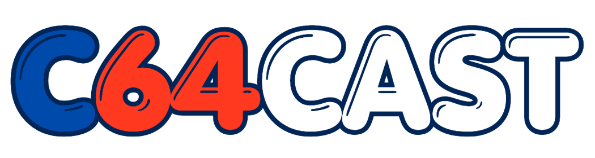

# c64cast

[](https://github.com/kfox/c64cast/actions/workflows/ci.yml)
[](https://codecov.io/gh/kfox/c64cast)
[](https://www.python.org/downloads/)
[](LICENSE)

Stream live AV through an [Ultimate 64](https://ultimate64.com/) so a real
C64 becomes a programmable display + audio device. Webcam frames are
quantized in real time to one of several VIC-II display modes (PETSCII, MCM,
hi-res bitmap, multicolor hi-res), audio is fed through the
SID's 4-bit DAC, and optional, stackable **overlays** can be used to decorate
scenes with scrolling text, PETSCII spectrum analyzers, clocks, weather, RSS tickers,
logos, large scrolling text messages, OBS status, and more.

Much of this code is still considered experimental — features will likely change.
Some features have been much more thoroughly tested than others.

## Features

* **Six display modes** — `hires`, `hires_edges`, `mhires`, `petscii`,
  `mcm`, `blank`. Each has its own vectorized quantizer that lands close
  to 30 fps for bitmap modes and 50/60 fps for char modes over a LAN.
  `blank` is a no-video PETSCII canvas built for title cards + overlays.
* **Playlist + scenes** — TOML-defined sequence of scenes (webcam,
  video, still-image slideshow, SID waveform visualizer,
  MIDI → SID synth, ASID client, blank canvas). Auto-interleaves video spots if
  you drop video files into
  the videos directory. **Single-scene mode** kicks in automatically when the
  playlist defines exactly one scene: no interstitial, no CTRL skip, and
  the scene loops forever — perfect for the per-feature demo configs in
  [`config/examples/`](config/examples/).
* **Overlays** that stack on any compatible scene:
  scrolling text, marquee, RSS ticker, PETSCII spectrum analyzer, clock,
  weather, callsign, countdown, network info, multi-line logo,
  demo-scene big text, OBS Studio status.
* **SID oscilloscope** — plays a `.sid` file natively on the U64 (via a
  small player PRG, not the firmware's own runner) and shows a per-voice
  waveform trace. The U64's SID registers are write-only and read back as
  open-bus zeros, so the tune is run a second time on a host-side
  [py65 6502 emulator](c64cast/sid_host_emu.py) that traps `$D400-$D418`
  writes and feeds them to an in-process [SID emulator](c64cast/sidemu.py).
* **MIDI → SID** — bridge a live MIDI source (USB controller, DAW) into
  the U64's SID and visualize each voice the same way the waveform scene
  does. Requires the `midi` extra.
* **ASID client** — receive the ASID protocol (streamed SID register
  writes over MIDI SysEx) from any ASID host — DeepSID in a browser,
  SIDFactory II, Plogue chipsynth C64 — and play it on the U64's real SID
  with the same 3-voice oscilloscope. Requires the `midi` extra.
* **Audio streaming** — mic input or PyAV-decoded movie audio resampled to
  8 kHz mono and bit-banged through `$D418` via an NMI ring buffer.
* **Live control** — Commodore key pauses, CTRL key skips, optional
  FastAPI control plane (`/pause`, `/resume`, `/skip`, `/reload`) for
  remote control, `SIGHUP` to reload config without restarting.
* **Preview window + recording** — optional pygame mirror of what the U64
  is showing, plus cv2-based stream recording to MP4.

## Quick start

```bash
git clone https://github.com/kfox/c64cast
cd c64cast

# Hard deps + every optional extra + dev tooling, into a uv-managed .venv.
# (This repo uses mise + direnv + uv; direnv activates .venv for you.)
uv sync --all-extras

# Plain-pip alternative (no uv): runtime extras only — the dev tools are a
# PEP 735 dependency-group, installed separately:
#   pip install -e .[all] && pip install --group dev

# "Hello world": scrolls big text across a solid canvas. Needs NOTHING but
# a reachable U64 — no webcam, mic, SID, or video files. Edit the URL at the
# top of the file to point at your U64, then run it. Ctrl-C to exit.
python -m c64cast --config config/examples/hello.toml

# Override the connection target without editing the file:
python -m c64cast --config config/examples/hello.toml -u u64://192.168.1.64
```

`-u/--url` is a scheme-aware target that picks the backend + endpoint:
`u64://HOST` or `http(s)://HOST` (Ultimate 64 / II+), `tr://` (TeensyROM+ over
auto-detected USB serial), `tr:///dev/cu.usbmodem*` / `tr://COM3` (a specific
serial device), or `tr://HOST` (TeensyROM+ over TCP). `$C64CAST_URL` is the env
fallback.

`hello.toml` is the gentlest starting point. From there:

```bash
# Try a single feature in isolation — one TOML per scene type / overlay:
python -m c64cast --config config/examples/scene-webcam-petscii.toml
python -m c64cast --config config/examples/overlay-clock.toml

# Build your own config the easy way — the interactive wizard walks you
# through either a single scene or a multi-scene playlist (with the "UP NEXT"
# interstitial, video interleaving, and loop control) and writes a c64cast.toml
# (needs the 'wizard' extra; auto-loaded when no --config is given):
python -m c64cast --init

# ...or by hand: config/c64cast.example.toml is a fully-annotated
# reference exercising every scene + overlay; copy the bits you want.
cp config/c64cast.example.toml c64cast.toml && $EDITOR c64cast.toml
python -m c64cast

# Validate any config + check which optional extras are installed without
# touching the U64 (skip the connectivity probe to keep it offline):
python -m c64cast --doctor --config c64cast.toml --skip-probe
```

Each file in [`config/examples/`](config/examples/) is a runnable
single-scene demo. See [`config/examples/README.md`](config/examples/README.md)
for the file index.

`python -m c64cast -h` lists every CLI flag grouped by section
(`connection`, `quick playback`, `video input`, `audio`, `vision input`,
`playlist`, `introspection`, `debug`).

### Quick playback (no config file)

Pass media files/directories/globs/URLs as positional arguments to play them
once, in order, without writing a TOML (mutually exclusive with `--config`).
Audio is on by default; `--no-audio` mutes.

```bash
# A video, a SID tune, then a folder of pictures, on an Ultimate 64:
python -m c64cast -u u64://192.168.1.64 clip.mp4 tune.sid assets/pictures/

# A clip on a TeensyROM+ over auto-detected USB serial:
python -m c64cast -u tr:// clip.mp4

# A YouTube URL (needs the 'yt' extra: uv sync --extra yt):
python -m c64cast 'https://youtu.be/dQw4w9WgXcQ'
```

### Launcher script

[`scripts/c64cast.sh`](scripts/c64cast.sh) is a thin convenience wrapper
around `python -m c64cast`. It `cd`s to the repo root and forwards every
argument, running through `uv run` when `uv` is on your `PATH` (so the
project `.venv` is always used) and falling back to a bare `python`
otherwise. Handy when invoking c64cast from another directory or from a
context where direnv hasn't activated `.venv` (cron, systemd, an ssh
one-liner):

```bash
scripts/c64cast.sh --config config/examples/hello.toml
scripts/c64cast.sh --doctor --skip-probe
```

Anywhere this README shows `python -m c64cast ...`, `scripts/c64cast.sh ...`
is an equivalent drop-in.

## Configuration

A config is a single TOML file (`--config PATH`, else `./c64cast.toml`,
else built-in defaults) that defines the playlist and every overridable
option. Three ways to author one, plus tooling to discover and validate it —
none of which needs the U64:

```bash
# Build one interactively (single scene or multi-scene playlist):
python -m c64cast --init                    # needs the 'wizard' extra

# Discover the config surface straight from the code (always in sync):
python -m c64cast --list-scenes             # scene types
python -m c64cast --list-overlays           # overlays + their restrictions
python -m c64cast --list-modes              # display modes
python -m c64cast --describe overlay:clock  # full reference for one thing
python -m c64cast --compat                  # overlay × display-mode matrix
python -m c64cast --print-schema            # JSON Schema for editor autocomplete

# Validate a config (and check which extras are installed) without hardware:
python -m c64cast --doctor --config c64cast.toml --skip-probe
```

The discovery output and the JSON schema are generated from the same field
metadata the loader runs on, so they can't drift from the code.
[`config/c64cast.example.toml`](config/c64cast.example.toml) is the fully-annotated
reference; see [docs/usage.md](docs/usage.md) for the complete config
walkthrough.

## Live controls

While the stream is running, you control it from the C64 keyboard itself
(c64cast polls `$028D`, the kernal's keyboard-modifier scratch byte, at
10 Hz):

| Key on the C64                             | What it does                                                                                    |
|--------------------------------------------|-------------------------------------------------------------------------------------------------|
| **Commodore (C=)** — tap                   | Pause: scene + overlays tear down, screen clears, audio stops                                   |
| **Commodore (C=)** — hold 3 s while paused | Resume: re-sets-up the same scene (audio + polling threads all come back)                       |
| **CTRL** — tap while playing               | Skip: advance to the next interstitial after the current frame                                  |
| **SHIFT** — tap while playing              | Cycle the current scene's display style (palette mode / edge variant / waveform subtune / etc.) |

The C= + CTRL chord pressed on the same poll tick prefers **pause** —
skip is suppressed. SHIFT held alongside C= or CTRL is dropped so a
thumb resting on shift doesn't phantom-cycle the style. Cycled style
persists across single-scene loop iterations and across pause/resume,
but resets to the configured default on a real scene boundary
(multi-scene transitions construct fresh display_mode instances).

Same actions are exposed over HTTP when `[control] enabled = true`:

```bash
curl -X POST http://127.0.0.1:8765/pause
curl -X POST http://127.0.0.1:8765/resume
curl -X POST http://127.0.0.1:8765/skip
curl -X POST http://127.0.0.1:8765/reload   # re-read config from disk
```

Or send `SIGHUP` to the process to trigger a config reload from the
shell.

## Documentation

* [docs/usage.md](docs/usage.md) — full config reference, scene/overlay
  catalog with options, suggested setups
* [docs/caveats.md](docs/caveats.md) — known quirks (6502 emulator
  scope, char ROM substitution, U64 endpoint variance, licensing of
  SIDs / videos)
* [docs/troubleshooting.md](docs/troubleshooting.md) — symptom-first
  index for "I saw X, what now?"
* [docs/extending.md](docs/extending.md) — how to add a new Scene,
  Overlay, DisplayMode, or interstitial Background
* [CLAUDE.md](CLAUDE.md) — architecture notes for code-spelunking AI
  assistants and for humans who like dense reference material

## Development

```bash
uv sync --all-extras    # or: pip install -e .[all] && pip install --group dev
pre-commit install      # ensure ruff + tests run before every commit
```

CI runs the same lint + tests on every push and pull request — see
[.github/workflows/ci.yml](.github/workflows/ci.yml).

There's a `Makefile` available that offers a few development targets:

```bash
⮑  make
targets:
  lint       ruff check
  test       unittest discover
  coverage   coverage report + HTML
  typecheck  mypy --strict (api/audio/playlist) + pyright (whole tree)
  bench      scripts/bench.py — async write pipeline
  schema     regenerate c64cast.schema.json from the config metadata
  check      lint + typecheck + test
  clean      remove build artifacts
```

## Hardware needed

* An [Ultimate 64](https://ultimate64.com/) — confirmed with Elite I or II,
  some testing done with the Ultimate II+ cartridge, as well. Likely to work
  with the new Commodore 64 Ultimate, which is similar to the Elite II.
  Under **F2 → Network Settings**, *both* **Ultimate DMA Service** and
  **Command Interface** must be enabled (TCP port 64 — the Command
  Interface toggle gates command dispatch even when the socket is open).
  The REST API is used for the few operations that have no DMA equivalent.
* Any C64 video output path supported by the U64 or C64 with U2+ cartridge.
* A webcam (any cv2-compatible USB device) if you want the live capture
  scenes.
* A microphone if you want live audio; otherwise the audio path can sit
  idle or play a movie file's soundtrack via PyAV.
* C64cast has thus far only been tested on modern macOS systems, but
  should work on any platform that supports Python 3 and the required
  third-party libraries.

There is no software emulator path for the *streaming* side — c64cast
writes directly to U64 memory/registers over the Ultimate DMA Service
(TCP port 64), with REST used only for the few non-DMA operations. SID
playback is
driven by a small player PRG uploaded into C64 RAM so the real 6510
calls PLAY at IRQ time (the U64 firmware's `runners:sidplay` runner is
deliberately avoided because it hijacks the HDMI output with its own
UI); see [docs/caveats.md](docs/caveats.md) for the PSID-only limitation.

## Acknowledgments

* [Gideon Zweijtzer](https://1541ultimate.net/) for the Ultimate 64
  hardware and firmware.
* The [HVSC](https://hvsc.c64.org/) team for the SID archive and the
  Songlengths database.
* [PyAV](https://github.com/PyAV-Org/PyAV) for the video path.
* Pex 'Mahoney' Tufvesson for the 8-bit `$D418` DAC technique (his
  ["Musings in the Key of C64" white paper](https://livet.se/mahoney/c64-files/Musings_in_the_key_of_C64_by_Pex_Mahoney_Tufvesson.pdf))
  behind the optional `dac_curve = "mahoney_ultisid"` audio path, Jürgen
  Wothke (websid) for the effective-bit analysis, Antonio Savona / Broken
  Bytes for the 48 kHz `$D418` write-up, and [CodeBase64](https://codebase64.org/)
  for the reference material.

## License

MIT — see [LICENSE](LICENSE).
