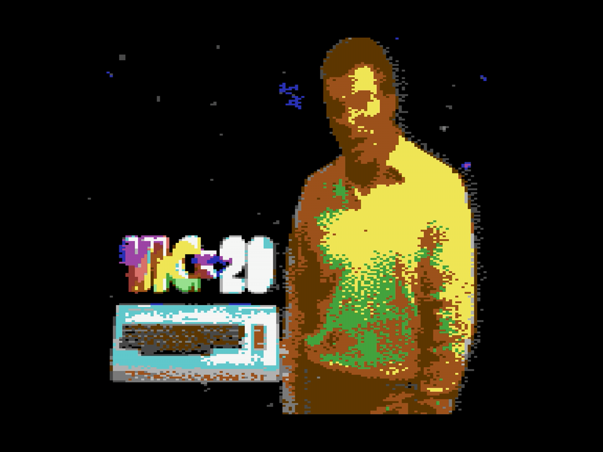

# Quick Start

This section gets a picture onto your Commodore 64 in about five minutes.
It assumes nothing except that you have a Commodore 64 Ultimate (or another
machine on the Ultimate platform — Chapter 1 sorts out the names), that it is
on your network, and that you have a computer nearby to run c64cast on.
Everything else in this guide can wait.

**Step 1: Turn on the services c64cast needs.** c64cast talks to your
Commodore over the network, and the firmware ships with the necessary
services switched off. Open the C64U menu by pressing the **Multi Function
Switch** upward, then press <kbd>F2</kbd> for **Advanced Settings**.

Under **Network Settings**, set:

- **Ultimate DMA Service** → **Enabled**
- **Web Remote Control Service** → **Enabled**

Under **Memory Configuration**, set:

- **Command Interface** → **Enabled**

Press <kbd>RUN/STOP</kbd> to back out of the menus, and confirm saving when
you are asked. You only ever have to do this once.

> [!NOTE]
> All three matter, and they are separate switches. The DMA Service is the
> fast path that paints the screen. The Command Interface gates it: with the
> Command Interface off, c64cast will connect and then hang. The Web Remote
> Control Service is a different service again, on a different port, and it
> is what starts SID tunes and native programs. On older firmware
> the last one is served alongside the web interface and has no switch of
> its own.

**Step 2: Install c64cast.** On your computer, in a terminal:

```bash
git clone https://github.com/kfox/c64cast
cd c64cast
uv sync --all-extras --no-dev
```

That last command builds a private Python environment with everything c64cast
can use. It assumes you already have Python and `uv` on your machine. If you
do not, see **Installing c64cast** in Chapter 1, which links to the
installation instructions for both.

**Step 3: Find your Commodore.** c64cast needs to know where to send
pictures. **Network Settings**, the same menu you were just in, shows the
machine's **Active IP address**.

While you are there, set **Use DHCP** to **Disabled** and give the machine a
static address, so that it does not move around and you only have to tell
c64cast once. With DHCP disabled the firmware's own default is
`192.168.2.64`, which is the address these examples use.

**Step 4: Put something on the screen.** This is the smallest interesting
thing c64cast does. It needs no video files, no microphone and no webcam:

```bash
python -m c64cast -u u64://192.168.2.64 \
    --config config/examples/hello.toml
```

Substitute your own address. Within a second or two the Commodore's screen
should clear to blue and a large scrolling message should slide across the
middle of it.


**Step 5: Stop it.** Press <kbd>Ctrl</kbd> <kbd>C</kbd> in the terminal.
c64cast puts the Commodore back the way it found it and exits.

> [!TIP]
> Tired of typing the address? Run the same command once with
> `--save-settings` on the end. c64cast remembers the connection target for
> every future run, and you can drop the `-u` from here on.

## Playing Something Real

The scroller proves the connection works. Now point c64cast at an actual
video file. Any format your machine can decode will do:

```bash
python -m c64cast clip.mp4
```

There is no configuration file involved. c64cast looks at what you handed
it, decides that a `.mp4` is a video, quantizes each frame down to what the
VIC-II chip can actually display, and plays the soundtrack through the SID.



The picture is 160 pixels across with four colours in each 8×8 cell, and it
is being computed and shipped over your network thirty times a second. It's
not a high-resolution display, but that's the point.

> [!NOTE]
> If nothing appears, the most likely cause is Step 1. Run
> `python -m c64cast --doctor` and c64cast will tell you what it can and
> cannot reach, in plain language. Chapter 1 covers this properly.

You now have a working setup. The next few pages suggest things worth trying
before you read any further.
