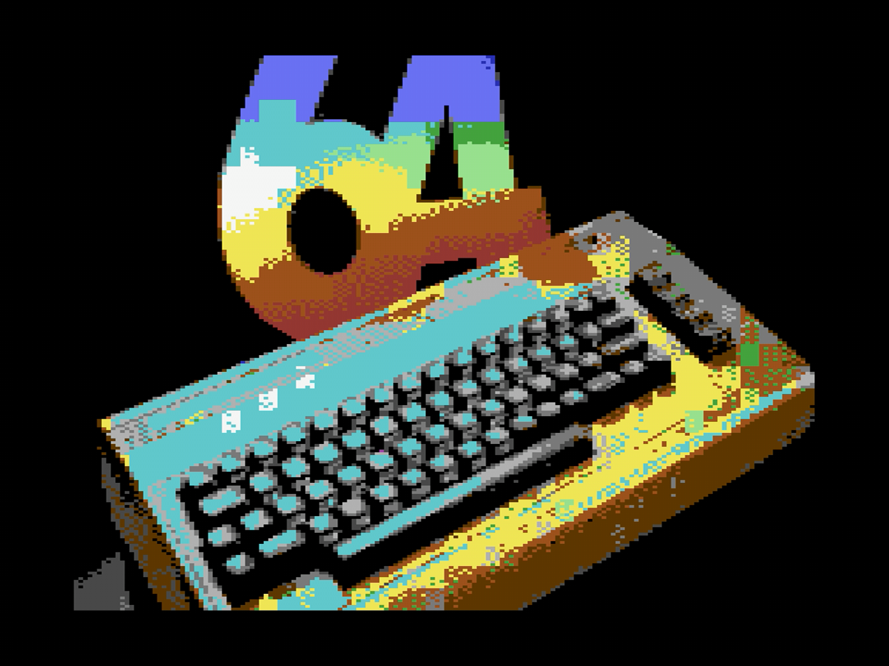

# Fun Things to Try!

The best way to learn what c64cast does is to point it at things. Here are a
few suggestions, all of which run without writing a configuration file.

- **Play a folder of pictures.** Hand c64cast a directory and it becomes a
  slideshow, fitting each image to the screen and dithering it into the C64
  palette. Try `c64cast ~/Pictures/holiday/`.

- **Play a SID tune.** Point it at a `.sid` file and the Commodore plays it
  on its own sound chip, with a three-voice oscilloscope drawn live from the
  chip's registers. This is not an emulation on your computer; the notes come
  out of the real SID.

- **Play a video from the internet.** Give it a YouTube link in quotes and
  c64cast resolves it, downloads a stream and plays it. If the link has a
  timestamp in it, playback starts there.

- **Queue several things up.** Arguments play in order:
  `c64cast clip.mp4 tune.sid ~/Pictures/`. Between each one c64cast
  shows a brief "UP NEXT" card, similar to a television channel.

- **Play a game.** Hand it a `.prg` or `.crt` and c64cast loads the program,
  gets out of the way and lets the Commodore be a Commodore again.

- **See everything on offer.** `c64cast --list-scenes` prints every
  kind of thing c64cast can put on screen, and `--list-overlays` prints
  everything it can decorate them with. No hardware needed.

And you are off. Once you have had a look around, come back here and start at
the Introduction for a proper tour.
