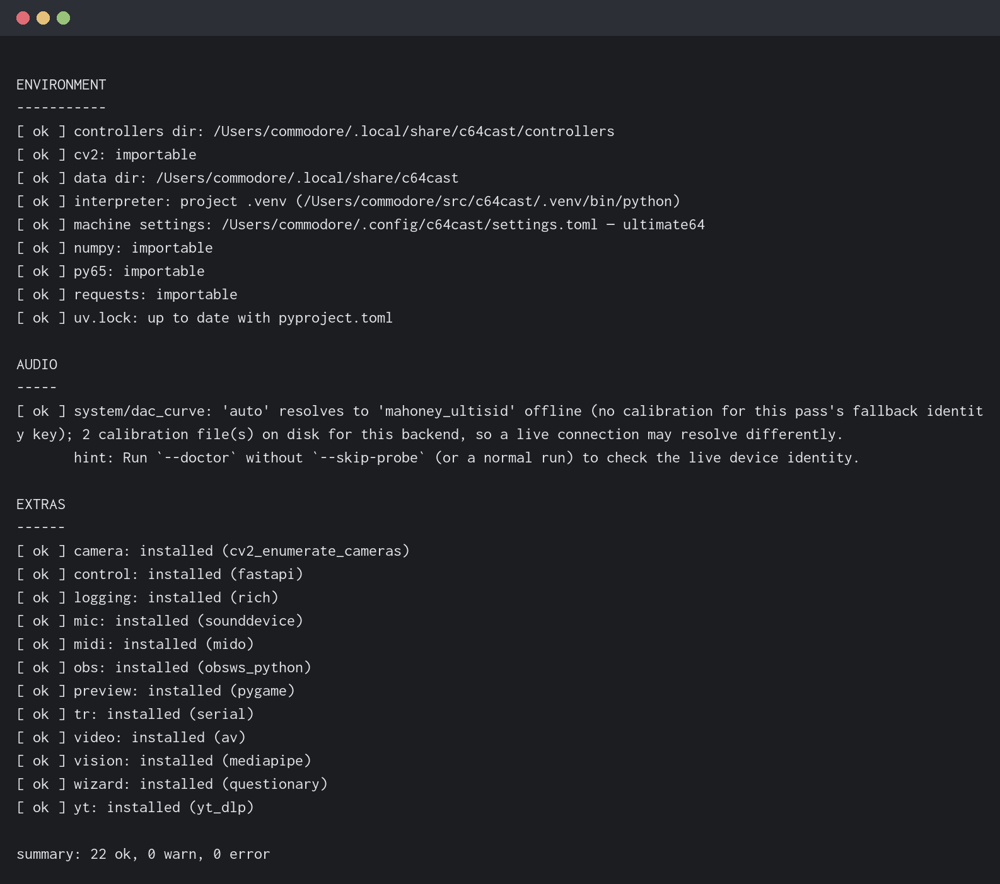

# Setting Up

This chapter takes you from a Commodore 64 sitting on a desk to a working
c64cast installation that reliably talks to it. If you followed the Quick
Start you have already done some of this; the rest fills in what was skipped
and explains why each piece is there.

## What You Need

c64cast writes directly into your Commodore's memory. It cannot do that
through the cartridge port alone, so it needs a device in the machine that
speaks to the outside world. Two families are supported.

### The Ultimate Platform

The **Commodore 64 Ultimate**, or **C64U**, is the most modern version of the
Ultimate platform and the machine this guide is written against. It connects
over Ethernet or Wi-Fi, it provides HDMI output, and it has the fastest link,
which matters when you are pushing thirty frames a second.

Several products are the same platform under different names. This guide uses
"C64U" throughout to mean any of them, because they function in essentially
the same way:

- **Commodore 64 Ultimate** (**C64U**) — the current machine, and this
  guide's reference.
- **Ultimate 64** and **Ultimate 64 Elite** — earlier boards of the same
  platform. Often shortened to **U64**, which is also where the `u64://`
  connection scheme gets its name.

The **Ultimate II+** is a cartridge rather than a complete machine. It
provides much of the same functionality, and most of this guide applies to it
unchanged, but it is **not** 100% compatible with every feature. Where a
difference matters, the text says so.

### The Other Path

The **TeensyROM+** connects over USB or over your network. It works well and
is a good deal cheaper, but it is a narrower pipe and some features are
unavailable on it. The text flags these as they come up.

### And a Computer

You also need a computer to run c64cast on, and a network path between it and
the Commodore. Wired Ethernet is noticeably steadier than Wi-Fi for this; the
traffic is many small writes rather than a few large ones, so latency matters
more than bandwidth.

## Enabling the Network Services

A C64U ships with the services c64cast needs switched off. Turning them on is
a one-time job.

1. Open the C64U menu: press the **Multi Function Switch** upward. On an
   Ultimate II+ cartridge, press the menu button on the cartridge instead.
2. Press <kbd>F2</kbd>. This opens **Advanced Settings**, where the rest of
   the machine's configuration lives.
3. Under **Network Settings**, set **Ultimate DMA Service** to **Enabled**.
4. In the same menu, set **Web Remote Control Service** to **Enabled**.
5. Back out, go to **Memory Configuration**, and set **Command Interface**
   to **Enabled**.
6. Press <kbd>RUN/STOP</kbd> to leave the menus. The C64U asks whether to
   save your changes; say yes.

> [!TIP]
> <kbd>RUN/STOP</kbd> is the way back out of anything in the C64U menus: it
> closes a pop-up, returns to the parent menu, and finally exits altogether.
> Press it a few times if you get lost.

Three switches, three different jobs, and it is worth knowing which is which
because the failure modes look nothing alike.

**The Ultimate DMA Service** is the fast path. It is a plain socket on port
64 that accepts memory writes. Every pixel c64cast puts on your screen goes
through it. Without it, nothing works at all.

**The Command Interface** gates the DMA service's command dispatcher. This
one catches people out: with the DMA Service on and the Command Interface
off, c64cast opens the socket successfully and then waits forever for a reply
that never comes. If your first run connects and then simply hangs, this is
almost certainly why.

**The Web Remote Control Service** is a separate service on a separate port,
handling the things a raw memory write cannot do: resetting the machine,
starting a native program, and launching SID tunes. Scenes that only paint
pixels will work without it. Scenes that start something running on the
Commodore will not.

> [!NOTE]
> On older Ultimate 64 and Ultimate II+ firmware the third service has no
> switch of its own and is served alongside the web interface, so it is
> already on. The separate **Web Remote Control Service** toggle appears on
> the Commodore 64 Ultimate.

If a firewall sits between your computer and the Commodore, allow outbound
TCP to port 64 and port 80 on the Commodore's address.

### Give It an Address That Does Not Move

While you are in Network Settings, do yourself a favor and pin the address
down. c64cast is much easier to live with when the C64U is always in the same
place: you can save the connection target once and never type it again.

Set **Use DHCP** to **Disabled**, then fill in **Static IP** along with the
netmask, gateway and DNS address for your network. Choose an address outside
the range your router hands out automatically. With DHCP disabled the
firmware's own default address is `192.168.2.64`, which is the address used
in the examples throughout this guide.

If you would rather leave DHCP on, reserve an address for the C64U on your
router instead. Either way the goal is the same: an address that survives a
reboot.

### If Your C64U Has a Password

A C64U can be configured to require a password for network access. c64cast
reads it from an environment variable:

```bash
export C64CAST_DMA_PASSWORD='your-password'
```

You can also put it in a configuration file, but the environment variable is
better and takes precedence when both are set. There is deliberately no
command-line flag for it: anything you type as an argument ends up in your
shell history and is visible to anyone who can list processes on your
machine.

## If Your TeensyROM+ Lives in an Ultimate

A TeensyROM+ works in any Commodore 64, and that includes a C64U or an
Ultimate 64: the Ultimate supplies the machine, the TeensyROM+ supplies the
link. That pairing needs one setting changed on the *Ultimate* side; without
it, what you play may come out with a steady hiss underneath.

Open the Ultimate's menu, press <kbd>F2</kbd>, and under **Cartridge and ROM
Settings** set **Bus Operation Mode** to **Writes**. Press <kbd>RUN/STOP</kbd>
to back out, and say yes when it offers to save.

The setting governs how much of what the machine does reaches the cartridge
port. Its default, **Quiet**, keeps that port quiet; **Writes** — or **Dyn. &
Writes**, which includes it — is what the TeensyROM+ needs. This one is worth
doing before you go looking for an audio option, because there isn't one: no
amount of shaping in c64cast will clear a hiss that comes from the bus.

## Installing c64cast

c64cast is a Python program, but you do not have to think of it as one. It
installs as a self-contained command-line tool, in its own private
environment, and nothing it depends on lands in your system Python.

The recommended way is [uv](https://docs.astral.sh/uv/), a single-binary tool
that installs Python programs and, if your machine has no suitable Python,
supplies one itself. Install `uv` by whichever method its own
[installation page](https://docs.astral.sh/uv/getting-started/installation/)
recommends for your operating system, then:

```bash
uv tool install 'c64cast[all]'
```

That is the whole installation. It puts a `c64cast` command on your `PATH`,
which you can confirm:

```bash
c64cast --version
```

And if you want to try c64cast without installing anything permanently, `uv`
will fetch it, run it once and throw it away:

```bash
uvx --from 'c64cast[all]' c64cast \
    --config example:hello -u u64://192.168.2.64
```

### What `[all]` Means

The `[all]` part asks for every optional feature: video file decoding, links
to video sites, microphone capture, MIDI, hand gestures, the LED bridge, the
web control service, the browser console and the configuration wizard. Some of
those are large, so plain `c64cast` without the brackets installs a much smaller
core that still covers every generative scene, both bitmap and character
rendering, SID playback and all the overlays.

While you are finding out what c64cast does, take `[all]`. It saves a great
deal of confusion about why a feature appears to be missing. You can always
narrow it later, or add features one at a time:

```bash
uv tool install 'c64cast[video,midi,web]'
```

> [!IMPORTANT]
> If you narrow the list, name every feature you want in that one command.
> Extras do not accumulate: a second `uv tool install` replaces the set rather
> than adding to it. The one people miss is `web`, which is the browser console
> in [Chapter 5](08-going-further.md#the-browser-console) — without it
> `--serve` reports the missing feature instead of starting.

> [!NOTE]
> Everything in this guide is written for `uv`. If you would rather not install
> it, [pipx](https://pipx.pypa.io/) is an equivalent fallback for anyone who
> already has Python 3.11 or newer — `pipx install 'c64cast[all]'` to install
> and `pipx upgrade c64cast` to update. Every other command in this guide is
> the same either way, because both put the same `c64cast` on your `PATH`.

> [!NOTE]
> If you would like to work on c64cast itself rather than only use it, the
> repository has a different setup — a checkout, a locked development
> environment and the test tooling —
> described in
> [`CONTRIBUTING.md`](https://github.com/kfox/c64cast/blob/main/CONTRIBUTING.md).
> You do not need any of it to use c64cast, and this guide assumes you have
> not done it.

## Upgrading

```bash
c64cast --upgrade
```

That is the whole thing, nearly always. It works out how you installed
c64cast — `uv tool`, pipx, plain pip, or a development checkout — and runs
that installer's own upgrade command, so you never have to remember which
one applies to you. It asks before doing anything (`--yes` skips the prompt
for a script) and keeps whichever optional features you already installed.

To ask without touching anything, `c64cast --check-for-updates` reports
whether a newer release exists and stops there.

The rest of this section is about what `--upgrade` does under the hood, and
the one way upgrading goes wrong even with it.

c64cast is not a folder you keep up to date. It is a command that lives in its
own private environment, and the `c64cast` on your `PATH` points into that
environment from wherever you happen to be standing. So downloading a release
and unpacking it into your working directory upgrades nothing at all: it leaves
a copy of the source sitting next to your configuration, and the command goes on
running the version it was already running. `c64cast --version` will go on
reporting the old number, correctly, because it reads the version of the
*installed* package and not of whatever files happen to be nearby.

`--upgrade` sidesteps that trap by acting on the install it finds rather than
asking you to identify it — but if you'd rather run the underlying command
yourself, `--version` still names it:

```
c64cast 0.3.0 (/home/you/.local/share/uv/tools/c64cast/lib/python3.13/site-packages)
```

The path names the environment the command actually runs from, and on the
way past it names the tool that owns it: `uv/tools/` here means
`uv tool upgrade c64cast`, `pipx/venvs/` means `pipx upgrade c64cast`.

**Optional features do not accumulate.** `--upgrade` keeps whichever extras
you already have — it does not add one a release just introduced. If you
want a feature that's new, name every extra you want in a single command and
let it overwrite what is there:

```bash
uv tool install --force 'c64cast[all]'
```

The quotes are for the shell's benefit, not c64cast's — some shells treat square
brackets as a pattern to match against filenames. Quoted, the line is safe to
paste into any of them.

Then check what you got, before any hardware is involved:

```bash
c64cast --version
c64cast --doctor --skip-probe
```

Doctor reads your configuration and reports which optional features the running
install can import, without touching the C64 — the quickest way to see both that
the upgrade landed and that your existing configuration still loads. Anything a
release actively needs you to do is at the top of its notes on the
[releases page](https://github.com/kfox/c64cast/releases), under *Upgrade notes*.

One last thing, if you gave your configuration the `#:schema` line from
Chapter 2. Written the way that chapter recommends, it names the schema *inside*
your install, so upgrading updates it too and there is nothing to do. Written as
a web address with a version number in it — the form older versions of this
guide suggested — it stays behind, and your editor goes on checking the file
against the release you first installed. `--doctor` reports that, and prints the
line to replace it with.

## Choosing Your Connection Target

One option tells c64cast both what kind of hardware you have and where to
find it. It is `-u`, and it takes a URL-like string whose scheme picks the
backend:

| Target | Means |
|---|---|
| `u64://192.168.2.64` | A C64U at that address |
| `http://ultimate-64.lan` | The same thing by hostname; the C64U is the only hardware that speaks HTTP |
| `tr://` | A TeensyROM+ over USB, found automatically |
| `tr:///dev/cu.usbmodem1234` | A TeensyROM+ on a specific serial device |
| `tr://COM3` | The same, on Windows |
| `tr://192.168.2.70` | A TeensyROM+ over the network |

The rarer settings ride along as query parameters, so they never need options
of their own:

```bash
c64cast -u 'u64://192.168.2.64?dma_port=64' clip.mp4
c64cast -u 'tr:///dev/cu.usbmodem1234?baud=2000000' clip.mp4
```

If you set the `C64CAST_URL` environment variable, c64cast uses it whenever
you do not pass `-u` explicitly.

## Saving Your Settings

Typing your Commodore's address into every command gets old immediately.
Run any command once with `--save-settings` and c64cast writes the
machine-specific parts of it to a settings file in your home directory:

```bash
c64cast -u u64://192.168.2.64 -d "HD Webcam" \
    --sid-model 8580 --save-settings
```

That records the connection target, the webcam device and the SID model, then
exits without running anything. `-d` and `-D` match on any part of a device's
name, so you never have to remember which number a camera happened to get;
`c64cast --list-devices` shows what is attached. From then on, every c64cast command on this
computer starts from those values, including the no-configuration quick
playback from the Quick Start:

```bash
c64cast clip.mp4
```

Settings saved this way sit underneath everything else. A configuration file
overrides them, and an option typed on the command line overrides that, so
saving a default never traps you. The password is never written to the file,
whatever else you pass.

## The Character ROM

Your Commodore draws text with a font baked into a chip on its board — the
character ROM. c64cast needs a copy of it, because everything it puts on
screen as C64 text is drawn with those glyphs: scrolling messages, the big
demo-scene scroller, the on-screen menu, the labels on the oscilloscope, and
the preview window on your computer.

You do not have to go and find one. The first time c64cast runs against a
machine, it reads the character ROM out of the C64 sitting in front of you and
keeps it in your data directory. It takes about a second, it happens once per
machine, and every run after that picks it up. Nothing is downloaded and
nothing is shipped with c64cast — the font travels from your hardware to your
disk and stops there.

If you ever want to do it deliberately — after fitting a different character
ROM, say — ask for it:

```bash
c64cast --dump-char-rom
```

And if c64cast cannot read from your particular setup, hand it a copy you
already have. This needs no hardware at all:

```bash
c64cast --install-char-rom /path/to/chargen.bin
```

Both check that what they were given really is a character set before saving
it, so a wrong file is refused rather than quietly making your text worse.

> [!NOTE]
> Until c64cast has a character ROM it falls back to a plain built-in font. Text
> is still readable, but it is not the Commodore's font, and the graphics
> characters come out blank. If your scrolling text ever looks blocky or wrong,
> this is nearly always the reason — run doctor and see what it says about the
> character ROM.

## Checking Everything with Doctor

When something is not working, ask c64cast what it thinks is wrong:

```bash
c64cast --doctor
```

Doctor checks your environment, your configuration and your hardware, and
reports everything it finds rather than stopping at the first problem. It
verifies that you are running the interpreter you think you are, that the
required libraries import, that your optional extras are installed, that your
configuration file makes sense, and that the Commodore answers.



Add `--skip-probe` to run every check except the ones that touch the
Commodore. This is the fast, offline version, and it is the one to reach for
when you are editing a configuration file and want to know whether it is
valid:

```bash
c64cast --doctor --config my-playlist.toml --skip-probe
```

> [!TIP]
> Doctor is the right first move for almost any problem, and it is much
> faster than guessing. If you are about to ask someone else why c64cast is
> not working, run doctor first and bring its output with you.

With the services on, c64cast installed and doctor reporting a clean bill of
health, you have everything you need. The next chapter puts it to work.
