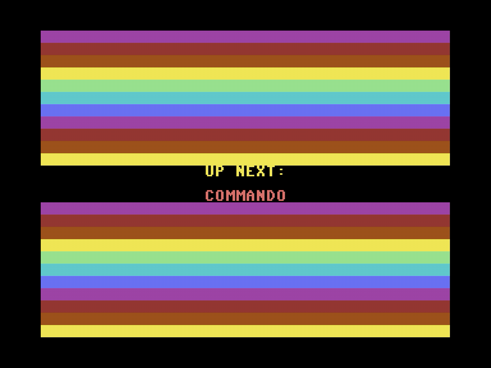
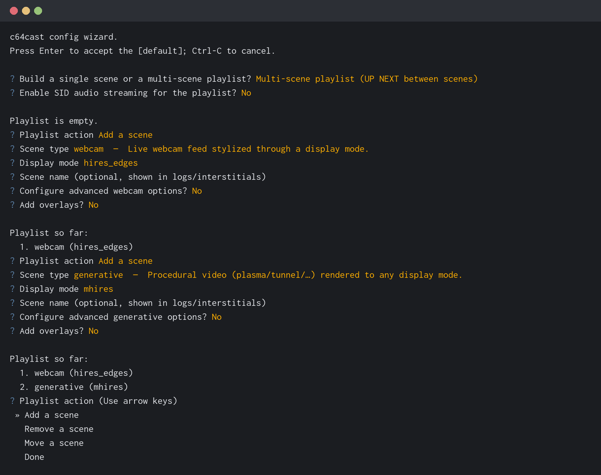

# Your First Playlist

So far you have handed c64cast one thing at a time and let it work out what
to do. That is genuinely useful, and for a lot of everyday use it is all you
need. But sooner or later you will want a running order that survives being
closed and reopened, with your own choices about how each thing looks. That
is what a configuration file is for, and this chapter builds one from
nothing.

## Playing Without a Configuration File

Start by understanding what you have already been doing, because the
configuration file is only a written-down version of it.

When you type `c64cast clip.mp4`, c64cast looks at each argument
and decides what kind of scene it describes. The rules are simple and based
on the file extension:

| You give it | You get |
|---|---|
| A video file, or a web link | A `video` scene |
| A `.sid` file | A `waveform` scene, with the oscilloscope |
| An image file | A `slideshow` scene |
| A `.prg` or `.crt` | A `launcher` scene, running it natively |
| An audio file | A `generative` scene that reacts to the music |
| A directory or a glob | The same, picking from what is inside |

Arguments play in the order you list them, once, and then c64cast exits.
Add `--loop` if you would rather it started over.

```bash
c64cast clip.mp4 tune.sid ~/Pictures/ --loop
```

Everything else in this chapter is a way of saying the same thing more
precisely, and keeping it.

## Your First Configuration File

A c64cast configuration is a TOML file: plain text, grouped into sections
inside square brackets. c64cast ships the smallest useful one as the demo
called [`hello`](https://github.com/kfox/c64cast/blob/main/c64cast/examples/hello.toml).
Here it is, with the comments removed:

```toml
[ultimate64]
url = "http://192.168.2.64"

[playlist]
interleave_videos = false

[[scenes]]
type = "blank"
name = "Hello"
border = 0
background = 6

  [[scenes.overlays]]
  type = "big_text"
  row = "middle"
  speed_cells_per_s = 12.0
  messages = [
    { text = "HELLO WORLD", color = "rainbow" },
    { text = "EDIT THIS TOML", color = "cyan" },
  ]
```

Copy it somewhere of your own and run it. The demos live inside c64cast
itself rather than in a folder you can browse, so ask it for the copy:

```bash
c64cast --print-example hello > my-first.toml
c64cast --config my-first.toml
```

(`c64cast --list-examples` shows every demo it can print or run.)

Now change something. Set `background` to `2` and the screen turns red. Add
another line to `messages`. Change `speed_cells_per_s` to `4.0` and watch the
text crawl. Each time, stop c64cast with <kbd>Ctrl</kbd> <kbd>C</kbd> and run
it again. This is the fastest way to learn what the settings do, and nothing
you can type here will harm the Commodore.

> [!TIP]
> If you name your file `c64cast.toml` and keep it in the directory you run
> from, c64cast finds it without being told. `--config` is only needed when
> the file is somewhere else or has another name.

## Anatomy of a Scene

Every `[[scenes]]` block describes one thing to put on screen. The double
square brackets are TOML's way of saying "another one of these", so a file
with three `[[scenes]]` blocks has three scenes, played in the order they
appear.

Three fields are common to every scene, whatever its type:

- **`type`** is what kind of scene it is. This one is required, and it
  decides which other fields are available. Run
  `c64cast --list-scenes` for the full list, and
  `--describe scene:video` for everything a particular type accepts.

- **`name`** is what the scene is called. It appears on the card between
  scenes, so it is worth setting to something readable.

- **`duration_s`** is how many seconds it runs before the playlist moves on.
  Video scenes are the exception: they play until the video ends, and setting
  a duration on one is an error rather than a silent override.

Everything else depends on the type. A `slideshow` wants to know where the
pictures are; a `waveform` wants a `.sid` file; a `blank` scene wants only
its colours, because its whole job is to be a backdrop for overlays.

## Adding a Second Scene

A playlist with one scene behaves specially: c64cast notices, drops the
card between scenes, and simply loops that scene forever. It is the right
behaviour for a demo, and it is what `hello.toml` relies on.

Add a second `[[scenes]]` block and the character changes entirely:

```toml
[[scenes]]
type = "blank"
name = "Welcome"
duration_s = 20.0
background = 6

  [[scenes.overlays]]
  type = "big_text"
  row = "middle"
  messages = [{ text = "NOW SHOWING", color = "rainbow" }]

[[scenes]]
type = "slideshow"
name = "Photographs"
duration_s = 60.0
file = "~/Pictures/*.jpg"
```

Now c64cast shows the title card for twenty seconds, then photographs for a
minute, then starts again. You have a channel.

## The Card Between Scenes

Between any two scenes, c64cast shows a brief interstitial: the words "UP
NEXT" and the name of the scene that is about to start, over a moving
background. It exists because cutting straight from one scene to another
looks like a fault, and because it gives the next scene time to load
whatever it needs.



Its own section controls how it looks:

```toml
[interstitial]
duration_s = 4.0
text_color = "rainbow"
background = "random"
```

`background` picks the animation behind the text. The choices are
`starfield`, `petscii_bars`, `raster_bars`, `checker`, `nature`, `city`,
`none`, and `random` to pick a different one each time. `text_color` takes
any C64 colour name, or `rainbow` for a per-row cycle, or `random`.

## Looping and Duration

The `[playlist]` section governs the running order as a whole:

```toml
[playlist]
loop = true
interleave_videos = false
videos_dir = "~/Videos/interstitials"
```

`loop` decides what happens after the last scene finishes. Left at `true`,
the playlist starts over. Set it to `false` and c64cast exits cleanly after
one pass, which is what you want for "play this and stop". The command line
can override it either way with `--loop` or `--no-loop`.

`interleave_videos` is a small luxury. Turn it on, point `videos_dir` at a
folder of clips, and c64cast drops a video in between every pair of scenes,
taking a different one each time. A playlist of five scenes becomes a
channel that keeps surprising you without any further work.

## Building One Interactively

You do not have to write any of this by hand. c64cast ships an interactive
builder:

```bash
c64cast --init
```

It asks what you want to build, offers the real choices for each setting
along with their defaults, lets you add, remove and reorder scenes, and
writes a properly-formatted, commented configuration file at the end. It
then offers to run it.



The builder is a good way to discover what exists. Every question it asks is
generated from the same definitions that produce `--list-scenes` and
`--describe`, so it can never offer you a setting that is not real.

> [!TIP]
> Before running a configuration you have edited by hand, check it:
> `c64cast --doctor --config my-first.toml --skip-probe`. This
> validates the whole file without touching the Commodore, and reports
> everything wrong with it at once rather than stopping at the first
> mistake. Misspelled a setting? It will suggest what you probably meant.

## Editing With Help

If your text editor understands TOML schemas, c64cast can drive its
autocompletion. It needs one line at the very top of your configuration file,
pointing at the schema — and the easiest way to get it right is to let
`c64cast --init` write the file for you, because it fills that line in
automatically.

To add it by hand, the form is:

```toml
#:schema https://raw.githubusercontent.com/kfox/c64cast/v0.1.0/c64cast/data/c64cast.schema.json
```

Replace `v0.1.0` with the version you are running (`c64cast --version`), so
the editor checks your file against the settings your copy actually
understands.

Editors with a TOML extension will then suggest valid settings as you type,
show the documentation for each, and underline anything that is not real.
The schema is generated from the same definitions as everything else, so it
is never out of date.

You now know how to describe what you want. The next chapter is about what
there is to want.
