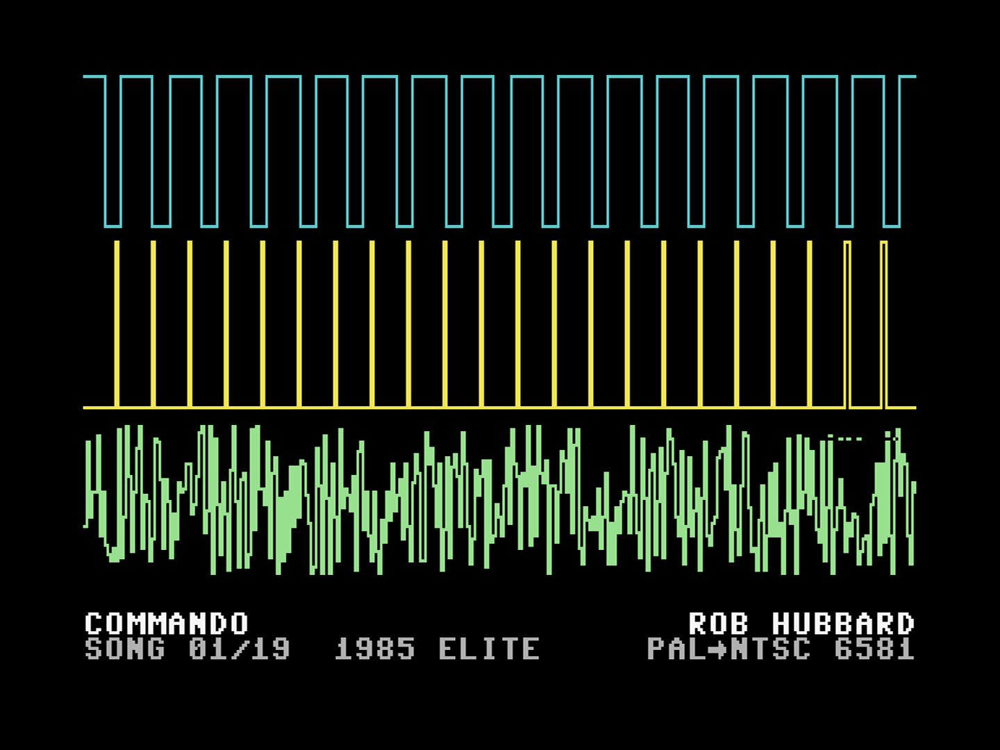
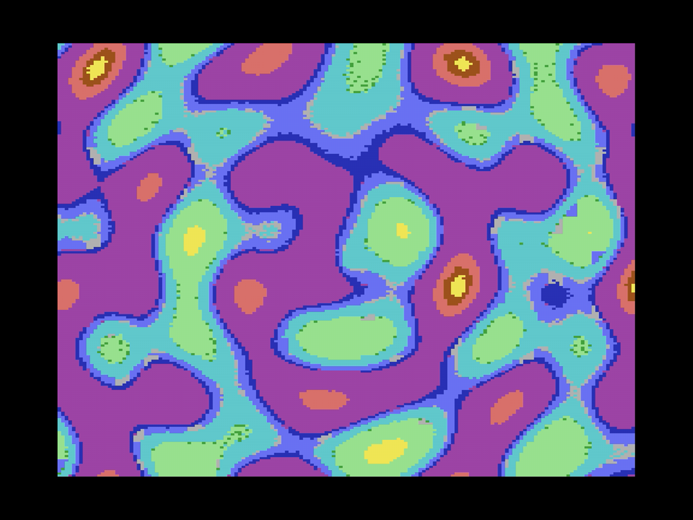
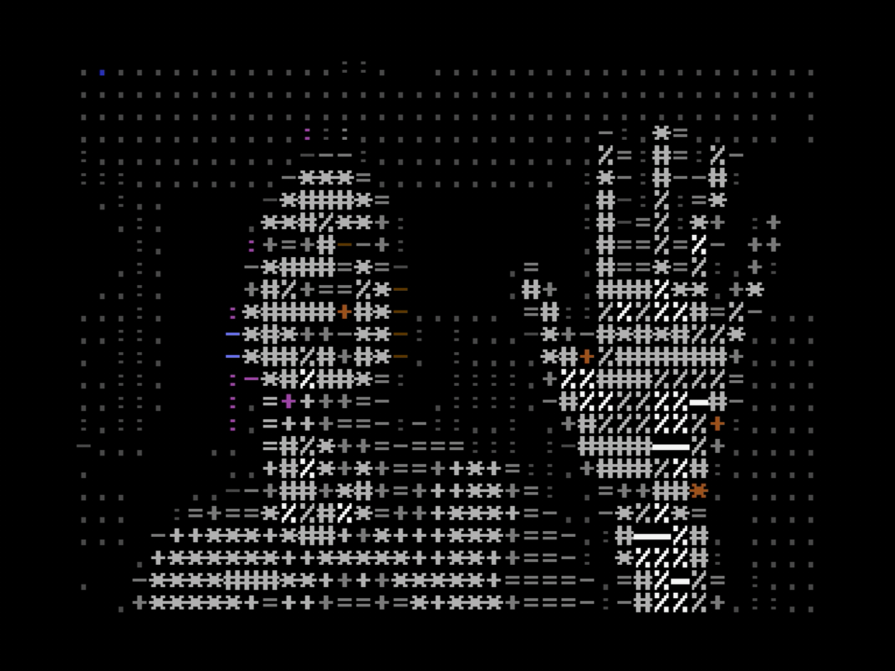

# The Scenes

A scene is one thing on the screen. This chapter walks through every kind
c64cast can run, starting with the ones that need nothing and working up to
the ones that need other equipment. Each section shows the smallest
configuration that works, and says what the scene is genuinely good at.

You do not need to read this chapter in one sitting. Find the scene you want,
try it, come back later for another.

> [!TIP]
> Every scene here has a ready-made demonstration shipped inside c64cast, one
> per scene type — `c64cast --list-examples` names them all. Run any
> of them directly: `c64cast --config example:scene-waveform`.
> Because each defines exactly one scene, it loops forever until you stop it.

## Blank

The simplest scene. It paints a solid canvas in the colors you choose and
does nothing else.

```toml
[[scenes]]
type = "blank"
name = "Title Card"
duration_s = 12.0
border = "black"
background = "blue"
```

On its own this is a colored rectangle. Its purpose is to be a backdrop:
every overlay that works on character modes works here, so a blank scene
plus a scrolling message is a title card, and a blank scene plus a clock and
the weather is an information board. Chapter 4 covers overlays properly.

Colors may be given as names or as numbers from 0 to 15. Names are matched
loosely, so `"light green"` and `"lightgreen"` both work.

## Slideshow

Still images, fitted to the screen and dithered into the C64's palette.

```toml
[[scenes]]
type = "slideshow"
name = "Photographs"
display = "mhires"
file = "~/Pictures/*.jpg"
duration_s = 60.0
image_duration_s = 5.0
```

Two durations, doing different jobs: `image_duration_s` is how long each
picture stays up, and `duration_s` is how long the whole scene runs before
the playlist moves on. The example shows twelve photographs, five seconds
each.

The `file` setting appears on several scene types and always means the same
thing: a comma-separated list of files, directories and glob patterns, whose
union forms a pool. Point it at a directory and you get everything in it.

```toml
file = "~/Pictures/holiday.jpg"         # one picture
file = "~/Pictures"                     # a whole directory
file = "~/Pictures/*.png"               # a pattern
file = "~/Pictures, ~/Downloads/*.jpg"  # both
```

> [!NOTE]
> A `~` means your home directory, and a path that starts with one always
> refers to the same place. A **relative** path like `assets/sids` does not: it
> is resolved from whatever directory you run c64cast in, so the same
> configuration file finds different material depending on where you launch it.
> Relative paths are convenient when you keep a configuration and its media
> together in one project folder, and a nuisance otherwise. If in doubt, write
> the path out in full.

Images are not shown in a fixed order. c64cast shuffles the pool and walks
through it, so every picture appears once before any repeats, and none ever
appears twice in a row.

## Video

A video file, with its soundtrack, played until it ends.

```toml
[[scenes]]
type = "video"
name = "The Clip"
display = "mhires"
file = "~/Videos/clip.mp4"
```

Note the absence of `duration_s`. A video scene runs for exactly as long as
the video does, and setting a duration on one is rejected rather than
quietly ignored, because the two ideas conflict.

Video is where c64cast works hardest. Each frame is decoded, scaled, color
corrected and quantized into whatever the display mode allows, then written
to the Commodore. The soundtrack is decoded in parallel and played through
the sound chip, and the video is paced off the audio clock rather than a
timer, so the two cannot drift apart over a long clip.

All that preparation takes a few seconds before the first frame appears, and
the Commodore doesn't keep it a secret: a striped loading bar grows across
the lower part of the screen while the scene gets ready, and the first frame
of video wipes it away. The right edge of the screen is 100% — no numbers
needed. If you would rather the screen stay dark while a scene loads, set
`setup_progress_bar = false` under `[video]`.

Web links work as file paths. Direct links to media play immediately; links
to video sites are resolved first, which needs the optional `yt` feature
installed. If the link carries a timestamp, playback starts there.

## Waveform

A SID tune, played on the Commodore's own sound chip, with a three-voice
oscilloscope drawn from the chip's registers.

```toml
[[scenes]]
type = "waveform"
name = "SID Jukebox"
file = "~/Music/hvsc"
duration_s = 180.0
color_mode = "per_voice"
voice_colors = ["cyan", "yellow", "light green"]
```

This is one of the most satisfying things c64cast does, and it is worth
being clear about what is happening. The tune is not being emulated on your
computer and streamed as audio. c64cast writes the tune and a small player
program into the Commodore's memory and starts it. The Commodore plays the
music itself, from its own chip. Meanwhile c64cast reads the state of the
three voices and draws them.



Point `file` at a directory and each time the scene starts it picks a tune at
random. Leave `duration_s` out and, if you have the SID song-length database,
c64cast plays each tune for its actual length.

`color_mode` decides what the colors mean: `per_voice` gives each voice its
own fixed color, and `per_waveform` colors by the waveform each voice is
currently using, so the picture changes as the music does.

### Getting Some Tunes

c64cast ships no music. The place to get some is the **High Voltage SID
Collection**, a decades-long archival effort that has collected tens of
thousands of tunes spanning the C64's entire history. It is free, and it is
the definitive source:

[hvsc.c64.org](https://www.hvsc.c64.org/)

Download the archive and unpack it wherever you keep music, then point a
waveform scene at it and let it pick:

```toml
[[scenes]]
type = "waveform"
name = "SID Jukebox"
file = "~/Music/hvsc"
```

Point `file` at the top of the collection and c64cast searches the whole tree,
so a single scene can draw on all of it.

> [!TIP]
> Unpacking the whole collection also gets you its song-length database, which
> lists how long every tune actually runs. Name it once and you can leave
> `duration_s` off entirely, and each tune plays for its real length instead
> of being cut off at an arbitrary number of seconds:
>
> ```toml
> [playlist]
> songlengths_file = "~/Music/hvsc/C64Music/DOCUMENTS/Songlengths.md5"
> ```
>
> c64cast also finds the database by itself, without being told, if the
> collection is unpacked into an `assets/sids/` folder in the directory you run
> from — which is the arrangement to prefer if you keep a configuration file
> and its material together in one project folder.

### The Two Sound Chips

The Commodore 64 shipped with two different sound chips over its life, the
6581 and the later 8580, and they do not sound the same. Tunes in the
collection are usually tagged with the one they were written for, and a tune
composed for one chip playing on the other can sound thin, harsh, or simply
wrong.

c64cast reads that tag and does what it can about it, with no configuration
from you. What it can do depends on the machine. An Ultimate 64 has real chips
in sockets and emulated ones in its FPGA, so it looks for a match: another
socket holding the right chip, or one of its emulated cores set to behave like
it. An Ultimate II+ has no sockets at all — the SIDs feeding its audio jack are
emulations from the start, so there is nothing to search for and it simply
tells them which chip to be.

Either way it is best-effort and temporary: your machine's own settings come
back when the scene ends. If you would rather choose yourself, `--sid-model
6581` or `--sid-model 8580` forces every tune to one chip and `--sid-model off`
leaves the tag unread.

### Which Cable You Listen To

On an Ultimate II+ this matters more than it sounds like it should, because the
two chips come out of two different sockets on two different pieces of
equipment.

The emulated SIDs — the ones c64cast configures — are heard on the **Ultimate's
own green audio output jack**, on the cartridge itself. Your Commodore's own
audio, the one carried by the AV cable to a 1702 or through an RF modulator to
a television, comes from the machine's own **internal SID**. Both are playing
the same tune at the same time, and they can be different chips.

So if you set out to hear the difference a model makes and listen through the
monitor, you will hear no difference at all — you are listening to the one chip
nothing can change. Plug headphones or a line-in into the Ultimate's green jack
and the same tune sounds as it was written to.

It is worse than merely hearing nothing change. If your machine has a 6581 and
the tune wants an 8580, c64cast will set the emulation to 8580 and that is the
right thing to do — but through the monitor the tune now plays on the unchanged
6581 and sounds thin and scratchy, while everything in the log says it matched.
The natural conclusion is that the SID is dying. It is not. c64cast says so
when it happens:

```
sid hardware: this tune plays as authored on the
Ultimate's own audio output, and on the wrong chip model
through the C64's AV output — the machine's internal SID
is what it is and no setting can change it. That is
expected here, not a failing SID: listen on the
Ultimate's audio jack to hear the tune as written.
```

An Ultimate 64 does not have this split: it *is* the Commodore, and its own
audio output carries the chips it configures.

### Telling c64cast Which Chip You Have

That internal chip is the one thing c64cast cannot look up. Over a network
connection to an Ultimate it can read the configured SIDs directly, but the
physical chip in the machine has no such register to ask.

So it guesses, from the oldest rule of thumb there is: NTSC machines usually
have the 6581, PAL machines usually the 8580. That rule is often right and
easily wrong — plenty of NTSC machines carry an 8580 — so c64cast prints a
warning saying it is guessing, and every judgement it makes about that chip
rests on the guess.

Tell it once and the warning goes away:

```toml
[hardware]
host_sid_model = "6581"
```

| Value | Meaning |
|---|---|
| `"auto"` | The default. Guess from NTSC/PAL and warn that it is a guess |
| `"6581"` / `"8580"` | This machine carries that chip. Stated as fact, no warning |
| `"unknown"` | Do not guess and do not judge. c64cast says nothing about that chip |

If you do not know which one you have, the label on the chip is the answer:
`6581` or `8580`, sometimes with a suffix like `8580R5`. Opening the machine to
look is not required — `"unknown"` is an honest setting, and everything else
still works.

> [!TIP]
> This is a property of your machine, not of any one show, so it belongs in
> your machine settings file rather than in a playlist. There is no flag for
> it — add the two lines above to `~/.config/c64cast/settings.toml` by hand
> (`--save-settings` writes that file but only covers the connection, the
> devices and `--sid-model`), and every future run on this computer picks it
> up.

Two settings, easily confused, and it is worth being clear about which is
which. `[ultimate64].sid_model` is about the **tune** — which chip it should be
matched to. `[hardware].host_sid_model` is about the **machine** — which chip
it actually contains.

### If Your Machine Has Two Chips Inside

Some Commodores have been modified to carry two SIDs internally — an ARM2SID,
a SIDFX, a DualSID board — with the second chip answering at another address,
commonly `$D420` or `$D500`. Often the two are set to different models, which
is much of the reason for fitting one: a 6581 and an 8580 in the same machine,
each tune played on whichever it was written for.

Tunes written for two chips play correctly on such a machine with nothing asked
of you. c64cast hands the tune to the machine and the tune writes to both
addresses itself; the chips are already where the tune expects them, so there
is nothing to route. This is true through a TeensyROM+ and through an Ultimate
II+ alike.

What c64cast cannot do is *guess* that your machine is one of these. Left
undeclared it assumes the ordinary single chip, and will tell you a second
chip is inaudible while you are listening to it. Declare the chips and it
stops guessing:

```toml
[hardware]
host_sid_chips = { d400 = "6581", d420 = "8580" }
```

Addresses are hexadecimal, with or without a leading `$`. Every chip gets its
own verdict against the tune, so a tune wanting an 8580 on its second chip is
judged against the chip that actually answers there. A chip whose model you do
not know can be written `"unknown"` — c64cast will note it is there and pass no
judgement on it.

This setting replaces `host_sid_model` rather than adding to it: once you have
listed the chips, the machine is described and the NTSC/PAL guess has nothing
left to guess at. List all of them, including the one at `$D400`.

> [!NOTE]
> A second SID mapped into `$DE00` or `$DF00` — an option on some of these
> boards — collides with a TeensyROM+ or Ultimate II+ in the cartridge port,
> which uses that same address range for its own registers. If your machine is
> configured that way, move the SID to `$D420` or `$D500`.

### Letting the Machine Pick the Tunes

Everything above is about *describing* your machine. There is one thing c64cast
can do about a mismatch, and it is not a hardware setting: when a waveform scene
points at a whole directory, it can pick from that directory with your chips in
mind.

```toml
[hardware]
host_sid_chips = { d400 = "6581" }
host_sid_tune_match = "prefer"
```

`"prefer"` tries tunes your chips can play as written before the rest — the
right model, and a chip at every address the tune drives. A single-SID machine
stops landing on two-chip tunes whose second voice-set goes nowhere, and a 6581
machine stops landing on tunes composed on an 8580. Nothing is thrown away: if
none of the tunes fit, one plays anyway, because a directory with nothing in it
that suits your machine is still better than a silent scene.

`"require"` is the stricter version — non-fitting tunes are dropped from the
pool rather than merely deprioritised. It still falls back to the whole
directory when nothing at all fits, and says so in the log, so a mistyped chip
table shows up as a warning instead of a scene that never starts.

The default is `"off"`: a directory you pointed at is a statement about what you
want played, and quietly narrowing it is a decision that ought to be yours.

Two things worth knowing. This never acts on the NTSC/PAL guess — if you have
not declared your chips, nothing is filtered, because dropping tunes out of your
own directory on the strength of a convention is not a fair trade. And only
`host_sid_chips` can skip a two-chip tune: `host_sid_model` names one chip
without claiming it is the only one, so on its own it checks the model and
leaves the chip count alone.

> [!NOTE]
> The waveform scene needs a bitmap display mode, and it needs the Web
> Remote Control Service from Chapter 1, because starting the player is a
> different kind of operation from painting pixels.

## Generative

Pictures computed from nothing, optionally reacting to music.

```toml
[[scenes]]
type = "generative"
name = "Plasma"
display = "mhires"
source = "plasma"
duration_s = 60.0
effect = "trails"
```

A generative scene is built from three independent choices. The **source**
is the pattern: about twenty of them, including `plasma`, `tunnel`, `fire`,
`mandelbrot`, `metaballs`, `rotozoomer`, `game_of_life` and `fireworks`. The
**effect** is an optional filter over the result: `trails`, `pulse`,
`rgb_shift` or `blur`. The **audio source** decides whether the picture
reacts to anything.



Setting `audio_source` turns a pretty pattern into a music visualizer:

| `audio_source` | What happens |
|---|---|
| `none` | Silent, and the pattern runs on its own clock. The default |
| `file` | Play an audio file through the C64, and react to it |
| `sid` | Play a `.sid` tune on the real chip, and react to it |
| `mic` | Play live microphone input through the C64, and react to it |
| `listen` | React to live input, but send no audio to the C64 |

`file` and `sid` both need a `file` setting naming what to play. This is what
happens behind the scenes when you hand c64cast an MP3 on the command line:
a reactive plasma over your track.

## Launcher

Hand the machine over to a real Commodore program, then take it back.

```toml
[[scenes]]
type = "launcher"
name = "Games"
file = "~/c64/programs"
duration_s = 120.0
reset_before_launch = true
```

c64cast resets the Commodore for a clean start, uploads the program and runs
it. From that moment the Commodore is simply a Commodore running a game or a
demo; c64cast is not drawing anything.

`duration_s` here is not a time limit but an **idle timeout**. c64cast
watches for keyboard and joystick activity, and only reclaims the machine
once that long has passed with no input. Someone playing a game is not
interrupted mid-level. Set `max_duration_s` if you do want a hard ceiling,
and `min_duration_s` to guarantee a minimum before the idle timer can fire.

## Webcam

A live camera, quantized to the C64 in real time.

```toml
[[scenes]]
type = "webcam"
name = "Live"
display = "petscii"
duration_s = 45.0
```



Choose the camera with `-d` on the command line: a number, or part of the
camera's name, or its USB identifier. `c64cast --list-devices`
prints everything it can find.

`display = "petscii"` builds the picture out of the Commodore's own
character set, choosing a glyph by brightness and a color by hue. It is the
mode people find most charming, and it is fast, because character modes move
far less data than bitmaps do.

## MIDI

Play the real SID chip from a keyboard.

```toml
[[scenes]]
type = "midi"
name = "SID Synth"
duration_s = 300.0
```

Connect a MIDI controller, and c64cast turns what you play into SID register
writes, with the same three-voice oscilloscope as the waveform scene. The
Commodore becomes a three-voice synthesizer that you play directly. This
needs the optional `midi` feature installed.

## ASID

Receive a SID stream from elsewhere on the network and play it on the real
chip.

```toml
[[scenes]]
type = "asid"
name = "Incoming"
duration_s = 300.0
```

ASID is a small protocol for sending SID register writes over MIDI. Several
programs speak it: the DeepSID website in a browser, the SIDFactory II
tracker, and various software synthesizers. Point one of them at c64cast and
whatever it plays comes out of your Commodore's actual sound chip, with the
oscilloscope drawn alongside. Composing on a tracker while a real SID plays
your work back is a genuinely different experience from hearing an emulator.

## WLED

Turn the Commodore into a video wall for lighting software.

```toml
[[scenes]]
type = "wled"
name = "LED Matrix"
display = "mhires"
duration_s = 120.0
```

This scene makes c64cast pretend to be an LED matrix. Lighting programs such
as LedFx and xLights stream pixels to it over the network in the usual
formats, and c64cast paints them on the Commodore's screen. It is the
inverse of the more common arrangement, and it is covered along with the
rest of the LED integration in Chapter 5.

## Choosing Between Them

If you are not sure where to start:

- For something impressive with no preparation, try **waveform** with a
  directory of SID tunes.
- For something that looks good on a shelf all day, a **slideshow** of
  photographs with a clock overlay.
- For a party, **generative** with `audio_source = "mic"`.
- For a demonstration to someone who knows what a Commodore is, **video**,
  because the disbelief is worth watching.

The next chapter is about making any of them look better.
