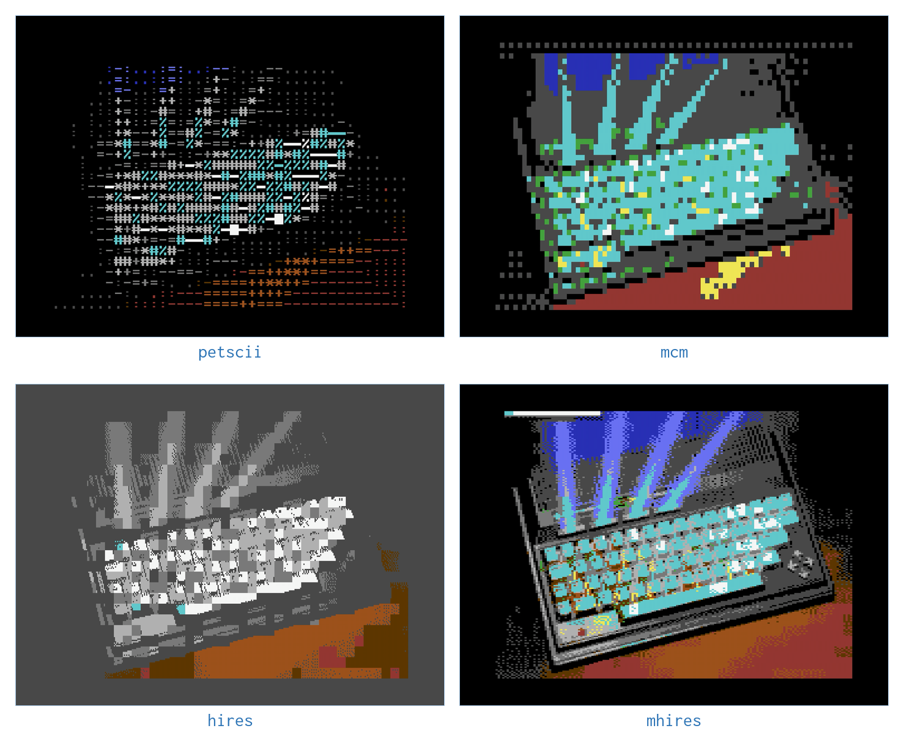
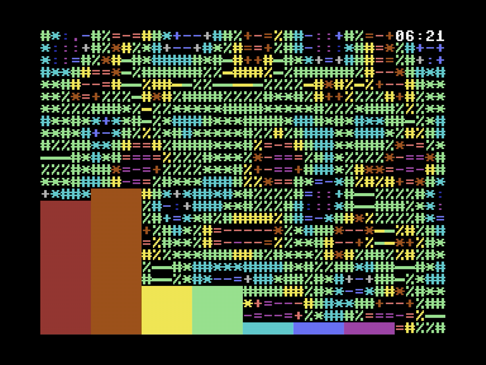

# Overlays, Colour and Display

The last chapter was about *what* goes on the screen. This one is about how
it gets there: how a modern picture becomes something a 1982 graphics chip
can display, what choices you have along the way, and how to stack
information on top of whatever is playing.

## The Six Display Modes

The VIC-II can arrange its screen in several ways, and each is a different
bargain between resolution and colour. c64cast exposes six, chosen with a
scene's `display` setting.

| Mode | Resolution | The trade |
|---|---|---|
| `mhires` | 160×200 | Four colours per 8×8 cell. Best for photographs and video |
| `hires` | 320×200 | Full resolution, but two colours per cell |
| `hires_edges` | 320×200 | Outlines only, white on black. Made for live cameras |
| `petscii` | 40×25 | Built from the Commodore's own characters |
| `mcm` | 80×50 | Multicolour characters, using an uploaded character set |
| `blank` | none | A solid canvas, for overlays to paint on |

The important thing to understand about the C64 is that its colour limits
are *spatial*, not global. All sixteen colours are available at once, but
only a few of them may appear within any one 8×8 block of pixels. Every
choice below is really a choice about how to spend that budget.

**`mhires` is the default for good reason.** Halving the horizontal
resolution buys four colours per cell instead of two, and for photographic
material that is overwhelmingly the better trade. Use it unless you have a
reason not to.

**`hires` keeps every pixel** and spends the colour budget instead. It suits
line art, text, diagrams and anything where a sharp edge matters more than a
hue.

**`petscii` builds the picture out of letters**, picking a character by how
bright each cell is and a colour by its hue. The result is unmistakably a
Commodore, and because character modes shift far less data than bitmaps, it
runs at the machine's full frame rate.



## Colour, and How It Is Chosen

Between the source picture and the screen sits a colour pipeline, configured
once in the `[color]` section and applied to every scene:

```toml
[color]
auto_fit = true
dither = "auto"
dither_strength = 0.5
color_match = "auto"
motion_smoothing = 0.25
```

**`auto_fit`** stretches contrast and saturation to suit the source. Real
footage is rarely made for a sixteen-colour palette, and letting c64cast fit
the material to the palette first makes a large difference. It is on by
default.

**`dither`** trades spatial noise for apparent colour. Without it, a gentle
sky gradient becomes visible bands; with it, the eye blends neighbouring
pixels back into the missing shades. Choices are `ordered`, `blue_noise`,
`floyd-steinberg`, `atkinson` and `none`.

**`color_match`** decides what "the nearest colour" means. `perceptual`
measures distance the way human vision does, which usually looks better;
`rgb` is a cruder measure that is occasionally more faithful to a specific
palette.

**`motion_smoothing`** applies only to `mhires`. Because that mode picks
four colours per cell per frame, a cell whose contents change can flicker as
its palette is re-chosen. Smoothing damps that at the cost of slight
after-images. Raise it for calm footage; lower it for fast motion.

Most of these are set to `"auto"` out of the box, which is not a refusal to
choose but a decision made per scene: a still slideshow gets
`floyd-steinberg` dithering, while moving video gets `blue_noise`, because
error-diffusion crawls unpleasantly when the picture moves.

> [!TIP]
> c64cast can recommend a palette for a specific source. Run
> `c64cast --suggest-palette photo.jpg` and it analyses the image
> and prints the C64 colours that represent it most faithfully, ranked. Feed
> those to `force_palette_colors` for a deliberately restricted look.

### Forcing a Palette

Setting `force_palette` restricts the picture to a chosen number of colours,
or to a specific list of them:

```toml
[color]
force_palette = true
force_palette_colors = ["black", "blue", "light blue", "white"]
```

This is a deliberate stylistic effect rather than a fidelity improvement.
Four cold colours make everything look like a monitor from a submarine
film, and that is sometimes exactly what you want.

## Overlays

An overlay is a decoration painted on top of a scene after the scene has
drawn itself. Overlays attach to a scene, several at a time, and paint in
the order you list them:

```toml
[[scenes]]
type = "slideshow"
name = "Photographs"
file = "~/Pictures"
duration_s = 120.0

  [[scenes.overlays]]
  type = "clock"
  row = 0
  fg_color = "white"

  [[scenes.overlays]]
  type = "scrolling_text"
  row = 24
  speed_cells_per_s = 6.0
  messages = [
    { text = "WELCOME", color = "yellow" },
    { text = "COFFEE AT ELEVEN", color = "cyan" },
  ]
```

`row` is the character row to paint on, counting from 0 at the top to 24 at
the bottom, regardless of the scene's display mode. Overlays occupy whole
rows, so keeping them at the top and bottom leaves the picture alone.

### What Is Available

Run `c64cast --list-overlays` for the current catalogue. At the
time of writing it holds:

| Overlay | Shows |
|---|---|
| `clock` | The time, and optionally the date |
| `weather` | Temperature and conditions, polled in the background |
| `rss` | A ticker fed from a news feed |
| `scrolling_text` | A row of messages, scrolling one after another |
| `marquee` | One string, scrolling continuously |
| `big_text` | Enormous demo-scene letters sliding across the screen |
| `callsign` | Fixed text in a corner, for a booth or a station ID |
| `countdown` | Time remaining until a date you set |
| `network` | Local address, hostname and link latency |
| `spectrum_petscii` | An audio spectrum drawn as coloured bars |
| `spectrum_bitmap` | The same, at pixel resolution, on `mhires` |
| `logo` | A block of PETSCII art loaded from a text file |
| `obs_status` | The current OBS Studio scene and dropped-frame count |



### Which Overlays Work Where

Not every overlay works on every display mode, because some paint characters
and some paint pixels. To see the whole matrix at once:

```bash
c64cast --compat
```

Two rules cover almost all of it. `big_text` takes over the entire display
while it scrolls, driving the hardware scroll registers directly, so it must
be the only overlay on its scene. And the spectrum analyser comes in two
versions because character modes and bitmap modes need genuinely different
implementations: use `spectrum_petscii` on character modes and
`spectrum_bitmap` on `mhires`.

## Sound

Audio has two possible paths out of the Commodore, and they are not close in
quality.

The **`$D418` DAC** works on every machine. It abuses the SID's volume
register as a crude digital-to-analogue converter, which is how digitized
sound was done on the C64 in period. Written the obvious way that gives four
bits, and c64cast can still do exactly that. By default it does something
better: it parks all three voices as steady sources and writes the whole
register each sample — volume, filter mode, and the voice-three switch —
which lands on roughly 256 distinct output levels. They are unevenly spaced,
so the useful resolution is nearer six or seven bits than eight, but it is a
long way past four.

It still sounds rough, because it is still a volume register being wobbled
twelve thousand times a second, and that roughness is most of the charm. It
is the only path available on a TeensyROM, and the path used for microphone
and webcam audio everywhere.

The **Ultimate Audio sampler** is available on the C64U. It is a
proper PCM sampler in the FPGA, entirely off the C64's bus, and it sounds
like a normal audio device.

```toml
[audio]
enabled = true
backend = "auto"
```

Left on `auto`, c64cast uses the sampler when the hardware has one and falls
back to the DAC otherwise. Set `backend = "dac"` to force the rough path
deliberately, which for some material is the more appropriate choice.

> [!NOTE]
> Because the sampler is off the C64's bus, video scenes using it can run at
> the machine's full frame rate. Scenes streaming audio through the `$D418`
> DAC cap their frame rate lower, because both the audio and the picture are
> competing for the same memory bus. This is a hardware limit, not a
> software one.

You now know how the picture is made. The last chapter is about doing
larger things with it.
