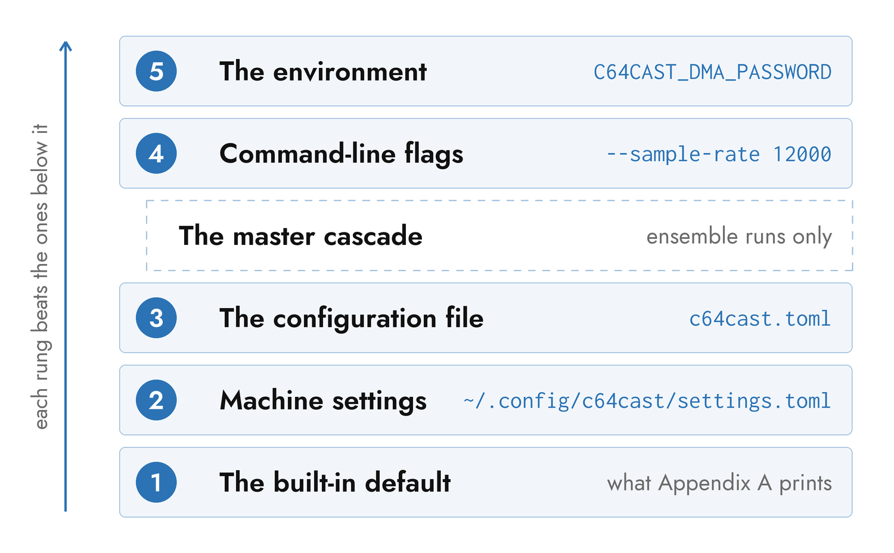

# The Configuration Language

A configuration file is TOML, and none of it is required. c64cast runs with no
file at all: every field has a built-in default, and the defaults describe a
working single-scene stream. What a file is *for* is to say which scenes run
and in what order, and to disagree with a default where you have a reason to.

Appendix A prints every section and every field with the value it holds when
you say nothing. This chapter is the set of rules those tables obey: which
file is read, what beats what, and what happens to a line the loader does not
recognise.

## Files and Where They Are Found

One configuration file is read per run, chosen by the first of these that
applies:

1. The file named by `--config PATH`. A missing file is an error, not a
   fall-through.
2. `./c64cast.toml`, if it exists in the directory you launched from.
3. Nothing, in which case the built-in defaults stand alone.

`--config` also accepts an `example:` name instead of a path, which addresses
one of the demonstration configurations shipped inside the package:

```bash
c64cast --list-examples         # every demo, listed
c64cast --config example:scene-waveform      # run one
c64cast --print-example scene-waveform > my.toml
```

The name is resolved to a real filesystem path before anything reads the file,
so everything downstream — the loader, an ensemble master's search for its
per-system files, `--doctor`, and the on-C64 menu's write-back — sees an
ordinary path and needs to know nothing about the prefix. An unrecognised name
is a usage error, exits 2, and prints the closest name it knows.

The packaged copy lives inside the installation and should be treated as
read-only; `--print-example` is the supported way to get a copy you own.
Appendix H lists every example by name, with what each one demonstrates.

### Paths Inside a File

A leading `~` is expanded wherever a configuration names a file: a scene's
`file` spec, `[debug].log_file`, `[recording].path`, a character ROM, a vision
model. A TOML file has no shell to do it, so c64cast does it itself, at the
point the path is used — the file keeps the string you wrote, and a
configuration you share does not carry your home directory in it.

A *relative* path is resolved against the directory you launched from, not
against the directory the configuration file sits in. That is convenient when
a configuration and its media live together in a project folder you work from,
and a nuisance in every other arrangement. The exception is an ensemble
master, whose per-system files resolve relative to the master itself; see "The
Ensemble Cascade" below.

### Editor Autocomplete

A JSON Schema for the whole file ships inside the package. A directive on the
**first line** of a configuration points a TOML-aware editor at it:

```toml
#:schema /path/to/c64cast/data/c64cast.schema.json
```

With that line, an editor that speaks the directive offers key and value
completion, shows each field's documentation on hover, and marks unknown keys
and out-of-range enumerations as you type. Every packaged example carries one,
and `c64cast --init` writes one into the file it generates: a local path when
it can work one out, otherwise the published URL pinned to the version you are
running. `c64cast --print-schema` prints the same document to standard output.

The schema is generated from the same field metadata as Appendix A, and it is
strict — a section name it does not know is an error rather than an unknown
extension. That matters, because the loader itself is not strict about section
names; see "Validation".

### Media on the Command Line

Naming media directly — `c64cast clip.mp4 tune.sid` — builds a configuration
in memory and writes nothing. It is mutually exclusive with `--config`, and it
climbs the same ladder as a file-driven run.

Each argument becomes one scene, in the order given, and the extension decides
which kind:

| Argument | Becomes | Recognised as |
|---|---|---|
| A video | a `video` scene | `.mp4` `.avi` `.mkv` `.mov` `.webm` `.m4v` |
| A tune | a `waveform` scene | `.sid` |
| An image | a `slideshow` scene | `.jpg` `.jpeg` `.png` `.bmp` `.webp` |
| A program | a `launcher` scene | `.prg` `.crt` |
| An audio track | a `generative` scene with `audio_source = "file"` | `.mp3` `.wav` `.flac` `.m4a` `.ogg` `.aac` `.opus` |
| A URL | a `video` scene | an `http://` or `https://` argument |

An audio track has no picture of its own, so it gets one: a plasma reacting to
the decoded track, which is what that `generative` scene is.

A directory or a glob is handed to the scene as its `file` spec rather than
expanded, so `c64cast ~/Music/hvsc` is a jukebox that draws a fresh tune each
time round. Everything it matches must map to one scene type; a directory
mixing tunes and videos is an error naming both.

A URL is stored as written and resolved when the scene is built — the same
path a configuration file's `file = "https://…"` takes. A direct media link is
opened as it stands; a page on a video site needs the `yt` extra. Any `t=`,
`start=` or `#t=` timestamp on it is parsed offline into the scene's `start_s`,
so a link copied at a moment starts there.

The arguments play once and c64cast exits; `--loop` repeats them instead.

## Naming the Hardware

One string says both what kind of machine to drive and where it is. It is
`-u/--url` on the command line, and `$C64CAST_URL` in the environment when no
flag was given.

```bash
c64cast -u u64://192.168.2.64 --config show.toml
c64cast -u tr:// clip.mp4
```

The scheme picks the backend; the rest is that backend's endpoint.

| Target | Reaches |
|---|---|
| `u64://HOST[:PORT]` | A C64U, over REST and the socket DMA service |
| `http://HOST`, `https://HOST` | The same machine, with the URL handed to the REST client verbatim |
| `tr://` | A TeensyROM+ over USB serial, on the device it detects |
| `tr:///dev/cu.usbmodemXYZ` | A TeensyROM+ on that serial device node |
| `tr://COM3` | The same, spelled the way Windows spells a serial port |
| `tr://HOST[:PORT]` | A TeensyROM+ over raw TCP, port 2112 unless you say otherwise |

`http(s)` is not a guess. The C64U is the only backend that speaks HTTP at
all, so the scheme names it as definitely as `u64://` does.

The serial-versus-TCP split for `tr://` falls out of the shape of the URL: no
host means serial, a host means TCP, and a `COM<n>` host means a Windows
serial port rather than a machine called COM3. Serial needs the `tr` extra,
which is the library that opens the port — and, for a bare `tr://`, the one
that finds the board by its USB identity.

An unknown scheme, or a target with no scheme at all, is a usage error
listing the ones that exist. It exits 2, before anything is opened.

### What a Target Decomposes Into

A connection target is not a setting in its own right. It is parsed once and
written into the fields that are the real store — the ones a configuration
file sets directly, and the ones Appendix A documents:

| Target | `backend` | And in that backend's section |
|---|---|---|
| `u64://192.168.2.64` | `ultimate` | `url = "http://192.168.2.64"` |
| `https://c64.local` | `ultimate` | `url = "https://c64.local"` |
| `tr://` | `teensyrom` | `transport = "serial"` |
| `tr:///dev/cu.usbmodem1234` | `teensyrom` | `transport`, `serial_port` |
| `tr://10.0.0.9:2113` | `teensyrom` | `transport = "tcp"`, `host`, `tcp_port` |

Only what the target actually carried is written, which is why a bare `tr://`
leaves `serial_port` alone for the auto-detect and leaves a baud rate you set
in a file in place. The equivalent of the first row, written out:

```toml
[hardware]
backend = "ultimate"

[ultimate64]
url = "http://192.168.2.64"
```

Neither form is more correct than the other. A file is the place for a machine
you drive every day; the flag is the place for a machine you are driving
today.

Four knobs are rare enough to have no flag of their own and ride along as
query parameters:

| Parameter | On | Sets | Default |
|---|---|---|---|
| `dma_port` | a C64U target | `[ultimate64].dma_port` | `64` |
| `tcp_port` | a TCP `tr://` | `[teensyrom].tcp_port` | `2112` |
| `baud` | a serial `tr://` | `[teensyrom].baud` | `2000000` |
| `storage` | any `tr://` | `[teensyrom].storage` | `"sd"` |

`storage` is where the TeensyROM+ stages the helper programs c64cast uploads —
its SD card, or a USB stick.

```bash
c64cast -u 'u64://192.168.2.64?dma_port=64'
c64cast -u 'tr:///dev/cu.usbmodem1234?baud=2000000&storage=usb'
```

Quote the target in a shell that treats `?` or `&` as its own.

In ensemble mode `-u` is rejected rather than applied to an arbitrary machine:
a wall has several connections, and the per-system files are where each one
belongs. `-d/--device` is refused for the same reason. See "Flags in Ensemble
Mode".

### NTSC or PAL

`-s NTSC` / `-s PAL`, or `[ultimate64].system`, states which video standard
the Commodore runs. It defaults to `NTSC`, and it lives in `[ultimate64]`
whichever backend is in use.

It is not a picture setting. It fixes the two numbers the rest of the program
derives from: the system frame rate, 60 or 50, which every scene's default
`target_fps` comes out of; and the CPU clock, 1022727 Hz against 985248, which
the digitised-audio timer and the host-side SID emulator are computed against.
Told the wrong one, c64cast asks a PAL machine for ten frames a second it will
never show, plays digitised audio 3.8% off pitch, and runs the oscilloscope's
emulator on a clock the real chip is not keeping — so the trace drifts against
the music it is drawing.

Like the connection, this is a property of the computer on the desk rather
than of the show, so it belongs in machine settings; `--save-settings` writes
it there.

### The Three Network Services

A C64U ships with the services c64cast needs switched off, and they are three
separate switches with three unrelated failure modes:

| Service | Without it |
|---|---|
| **Ultimate DMA Service**<br>Network Settings | Nothing works. Every pixel is a memory write over this socket, and the run fails at startup |
| **Command Interface**<br>Memory Configuration | The socket opens and the run then hangs forever — the listener accepts, and no command is ever dispatched |
| **Web Remote Control Service**<br>Network Settings | Pixels still paint. Reset, program launch, SID playback and every memory *read* — the keyboard poll, the on-C64 menu, the character-ROM dump — do not |

The first two are what the startup error names, in that order, when the DMA
socket cannot be opened; the third is the answer to a run that paints happily
and never starts a tune. Changing any of them needs a save, and a reboot of
the machine.

On older Ultimate 64 and Ultimate II+ firmware the third has no switch of its
own and is served alongside the web interface, so it is already on.

The *User's Guide* walks the menus keypress by keypress, and is the better
page to have open while you are in front of the machine.

## The Shape of a Value

Values are ordinary TOML, but several kinds recur across sections and are
worth stating once.

**Colours.** Anywhere a colour is taken, it may be a name or an index from 0
to 15. Names are matched loosely and case-insensitively, so `"light green"`,
`"lightgreen"` and `"lgrn"` all reach the same entry. A few fields accept
`"rainbow"` (a colour per row) or `"random"` in addition.

**Asset specs.** A scene's `file` is a comma-separated list whose members may
be literal paths, directories, or glob patterns; their union forms a pool. A
bare directory is scanned one level deep, and `**` walks a tree at any depth.

```toml
file = "~/Music/hvsc/MUSICIANS/G"    # a directory
file = "~/Music/hvsc/**/*.sid"       # a whole tree
file = "~/Videos/promo.mp4, ~/clips" # the union of both
```

The pool is re-resolved at every scene setup and one member picked at random,
which is why a directory rotates naturally across the loops of a single-scene
run while a single literal path stays deterministic.

**`"auto"`.** A field whose default is the string `"auto"` holds not a value
but a decision deferred to the point where the answer is knowable: the scene
type, the display mode, or what the hardware turned out to support.
`[color].dither` resolves differently for a slideshow than for a video;
`[audio].backend` resolves by what the machine on the other end offers. Every
`"auto"` field documents what it resolves to and when, and `--doctor` reports
the resolution it reached for the configuration in front of it. An explicit
value passes through untouched.

**Tri-states.** A few fields take `true`, `false` or `"auto"` and nothing
else. A near-miss like `"on"` or `"yes"` is rejected at load rather than
quietly read as truthy.

**Durations** are seconds, written as floats by convention though TOML accepts
an integer. Zero carries a per-field meaning — usually "no limit" — which that
field's entry in Appendix A states.

## The Precedence Ladder

Every value is resolved through one ladder, and every layer beats the ones
below it:

| Layer | Where it comes from |
|---|---|
| 1 | The built-in default — the value in the dataclass field |
| 2 | Machine settings, `~/.config/c64cast/settings.toml` |
| 3 | The configuration file |
| 4 | Command-line flags |
| 5 | The environment (`C64CAST_DMA_PASSWORD`) |



**The default** is what Appendix A prints. It is chosen to be what most runs
want rather than what does least: audio is on, the display pipeline's quality
stages are on, and a scene with no `display` gets the mode that suits its kind
of source.

**Machine settings** answer "what is true of this computer" — which Commodore
is on the desk, which capture device is plugged into it, which SID chips it
has. They belong to the machine rather than to the show, which is why they sit
below the configuration file and why they apply to a run that has no
configuration file at all. The next section covers them in full.

**The configuration file** is the show: the playlist, and any global setting
the show needs to differ on.

**Command-line flags** are this run. Every overridable flag defaults to `None`
internally, so "you passed the default" and "you passed nothing" stay distinct
— `--sample-rate 12000` overrides a file that says 8000, even though 12000 is
also the built-in default.

Two environment variables sit near this layer without being part of it.
`$C64CAST_URL` is a *fallback* for `-u`, consulted only when no `-u` was
given, so an explicit flag always wins; it is otherwise exactly a flag.
`$C64CAST_SETTINGS` names the machine-settings file rather than supplying any
value of its own.

**The environment** proper is one variable. `C64CAST_DMA_PASSWORD` overrides
`[ultimate64].dma_password` from the file, and it is an environment variable
precisely because it is a secret: there is deliberately no command-line flag
for it, so it cannot reach shell history or a process listing.

### Seeing Which Layer Answered

Three things will tell you where a value came from.

`c64cast -v` logs the file it loaded, and logs the machine-settings file with
a field count when one was applied — one line each, at the top of a run.

`c64cast --doctor --skip-probe` prints the resolved locations of the machine
settings and the data directory, and reports what the `"auto"` fields resolved
to for the configuration it was given. It needs no hardware.

`c64cast --describe section:NAME` prints what each field would be with nothing
said at all, which is the value the ladder starts from.

## Machine Settings

Machine settings are a per-machine overlay of *defaults*, applied to every
kind of run — a configuration file, an ensemble, or quick playback from the
command line. The point is not to have a second configuration file. The point
is that `-u`, `-d` and `--sid-model` describe hardware that does not change
between runs, and retyping them is friction.

The file lives at `~/.config/c64cast/settings.toml`, honouring
`$XDG_CONFIG_HOME`; on Windows it is `%APPDATA%\c64cast\settings.toml`.
`$C64CAST_SETTINGS` overrides the whole path.

It holds any non-playlist section — a connection, `[video].device`,
`[ultimate64].sid_model`, `[color]` preferences, whatever this machine should
assume. It may **not** hold `[[scenes]]` or `[ensemble]`: those are a show,
not a machine, and are dropped with a warning naming the file.

### Writing It With `--save-settings`

The flag persists the machine-relevant flags of the invocation it is attached
to, then exits without running anything:

```bash
c64cast -u u64://192.168.2.64 -d "Cam Link" \
        --save-settings
```

Savable this way: `-u/--url` (decomposed into `[hardware].backend` and the
matching connection section), `-d/--device`, `-D/--audio-device`,
`--sid-model`, and `-s/--system`. The write merges onto whatever the file
already held, prints the result, and exits 0. An invocation carrying none of
those flags has nothing to save and exits 2.

Two deliberate refusals. `$C64CAST_URL` is never saved — an environment
variable is a temporary override, and silently making it permanent would be a
surprise. The DMA password is never written to this file, or to any file the
serializer produces.

Everything else is a hand edit. The file takes the same sections as any
configuration, so the annotated reference and the schema apply to it
unchanged.

## Scenes and Playlists

A scene is one `[[scenes]]` table. The double brackets are TOML's
array-of-tables syntax, and the array's order is the order the scenes play in.

```toml
[[scenes]]
type = "waveform"
name = "SID Jukebox"
file = "~/Music/hvsc"

[[scenes]]
type = "slideshow"
name = "Photographs"
display = "mhires"
file = "~/Pictures"
duration_s = 60.0
image_duration_s = 5.0
```

Every scene takes `type`, an optional `name`, an optional `duration_s` and an
optional `target_fps`; Appendix B lists those and everything each type adds.
Chapter 2 is the vocabulary itself.

Overlays attach to a scene as a nested array of tables,
`[[scenes.overlays]]`, and paint in declaration order:

```toml
[[scenes]]
type = "blank"
duration_s = 30.0

  [[scenes.overlays]]
  type = "clock"
  corner = "top-right"

  [[scenes.overlays]]
  type = "marquee"
  text = "PRESS COMMODORE KEY TO PAUSE"
  row = 0
```

The indentation is cosmetic — TOML attaches a nested table to the most recent
`[[scenes]]` regardless — but it makes a long playlist readable, and every
example in this book uses it.

`[playlist]` governs what happens around the scenes: whether the list repeats
after the last one (`loop`, with `--no-loop` to run once and exit), whether a
video from `videos_dir` is inserted between scenes (`interleave_videos`),
where the SID song-length database lives, and how long the fade to and from
black takes at each scene boundary. `[interstitial]` styles the "UP NEXT" card
shown between scenes.

### Single-Scene Mode

A configuration that defines exactly one scene enters single-scene mode. There
is no flag for it; it is detected from the count.

In single-scene mode the interstitial is never built, the scene loops by
tearing down and setting up again — so a directory of tunes picks a new one
each time round — and the CTRL skip is ignored, there being nothing to skip
to. Pause and the style cycle still work. `interleave_videos` is
short-circuited, because inserting a video would make the playlist two scenes
long and silently defeat the mode.

Every packaged example is a single-scene configuration, which is why each one
runs until you stop it.

## The Ensemble Cascade

A master file with an `[ensemble]` table drives several Commodores from one
process. Each named system gets its own connection, audio, playlist and worker
thread.

```toml
# master.toml
[ensemble]
systems = [
    { name = "left",   config = "left.toml"   },
    { name = "middle", config = "middle.toml" },
    { name = "right",  config = "right.toml"  },
]

[interstitial]
duration_s = 3.0
```

Each per-system file is a complete, standalone configuration — running
`c64cast --config left.toml` drives that one machine and nothing else, which
is how a wall gets debugged. Their paths are resolved relative to the **master
file's own directory**, so a folder holding a master and its systems can be
moved, or run from anywhere.

The order of `systems` is load-bearing: index 0 is the leftmost physical
screen and the last entry the rightmost. The cross-system orchestrators in
Chapter 6 map content across the wall by that order.

### The Extra Layer

An ensemble inserts one layer into the ladder. Each system resolves defaults,
then machine settings, then its own file; then the master's cascade fills in
only those fields still sitting at the machine-overlaid baseline; then flags
and the environment as before. A per-system file therefore always beats the
master that gathered it.

These sections cascade from the master into every system:

| Section | Notes |
|---|---|
| `[ultimate64]` | except `url` — every machine has its own address |
| `[audio]`, `[color]`, `[playlist]`, `[interstitial]` | the show's global look and sound |
| `[preview]`, `[recording]`, `[debug]`, `[menu]`, `[performance]` | |

`[control]` and `[midi_control]` are read from the master and are **not**
cascaded: there is one control plane and one MIDI surface for the process, not
one per system.

`[[scenes]]` and `[video]` never cascade. A playlist and a capture device
belong to one machine by their nature; sharing a scene across systems is what
`orchestrate` is for, not a side effect of inheritance. `[[scenes]]` in a
master file is ignored with a warning.

Anything else in a master file — `[hardware]`, `[teensyrom]`, `[dsp]`,
`[vision]`, `[wled]` — is not read at all. Those belong in the per-system
files.

> [!NOTE]
> The cascade's test for "this system set the field itself" is "the value
> differs from the baseline". TOML does not report which keys were present, so
> a per-system file that explicitly sets a field *to* the baseline value looks
> exactly like a file that never mentioned it, and the master's value wins. If
> you need one system to hold the default against a master that overrides it,
> set the master to the default as well.

### Flags in Ensemble Mode

`-u/--url` and `-d/--device` are rejected in ensemble mode rather than applied
to an arbitrary system: they name one machine's hardware, and the per-system
files are where that belongs. Every other flag applies uniformly to every
system.

## Validation

Problems are caught at four moments, and the earlier ones are worth provoking
on purpose before a show.

**Parsing.** A TOML syntax error names the file, the line and the column, and
prints the offending line with a caret under it.

**Loading.** An unknown key inside a section it recognises is dropped with a
warning naming the section, the key, and the closest key it knows — a misspelt
`dither_strengh` tells you so. It is a warning rather than an error because a
configuration written for a newer version should still run. Values are checked
as they land: a tri-state that is neither boolean nor `"auto"`, a malformed
camera identifier, an empty audio-device string, and a `[color]` forced-palette
specification that does not describe a palette all raise here.

A misspelt *section* name is the one class of typo the loader does not report:
it looks for the sections it knows, and never asks what else was in the file.
This is exactly what the `#:schema` line catches, in the editor, as you type.

**Building a scene.** The per-scene checks run when the playlist is assembled:
an unknown display mode, a `file` spec that resolves to nothing, a required
field that is absent, `duration_s` on a video scene (rejected, because a finite
duration would either truncate a long clip or do nothing to a short one), an
overlay attached to a display mode that cannot host it, and a scene declaring
`orchestrate` without the `name` that makes it addressable.

**Running.** What is left is what only the hardware can answer: whether the
Commodore is reachable, whether the DMA service is enabled, whether the camera
opens.

### `--doctor`

`--doctor` runs every check that does not require the stream to start, prints
a grouped report, and exits.

```bash
c64cast --doctor --config my.toml     # full, with probe
c64cast --doctor --config my.toml --skip-probe
c64cast --doctor --config example:ensemble/master
```

It never stops at the first failure — a broken scene 1 does not hide a broken
scene 5 — and it reports on a whole ensemble system by system. The report is
grouped: **ENVIRONMENT** (the version, the interpreter, the hard dependencies,
where settings and data resolved to, which character ROM is in use), **SCENE**
(one line per scene, with its resolved display mode and overlay count),
**AUDIO** (what the `"auto"` backend and DAC-curve fields resolved to),
**ORCHESTRATOR** for an ensemble, **EXTRAS** (which optional features are
installed, with the command to install a missing one), and **CONNECTIVITY**
unless you skipped the probe.

Each row is `ok`, `warn` or `error`. The exit code is 0 when every row is `ok`
or `warn`, and 1 when any row is an `error` — which makes it safe to gate a
script on.

`--doctor --skip-probe` is the fast offline check, and the one to run after
editing a file.
