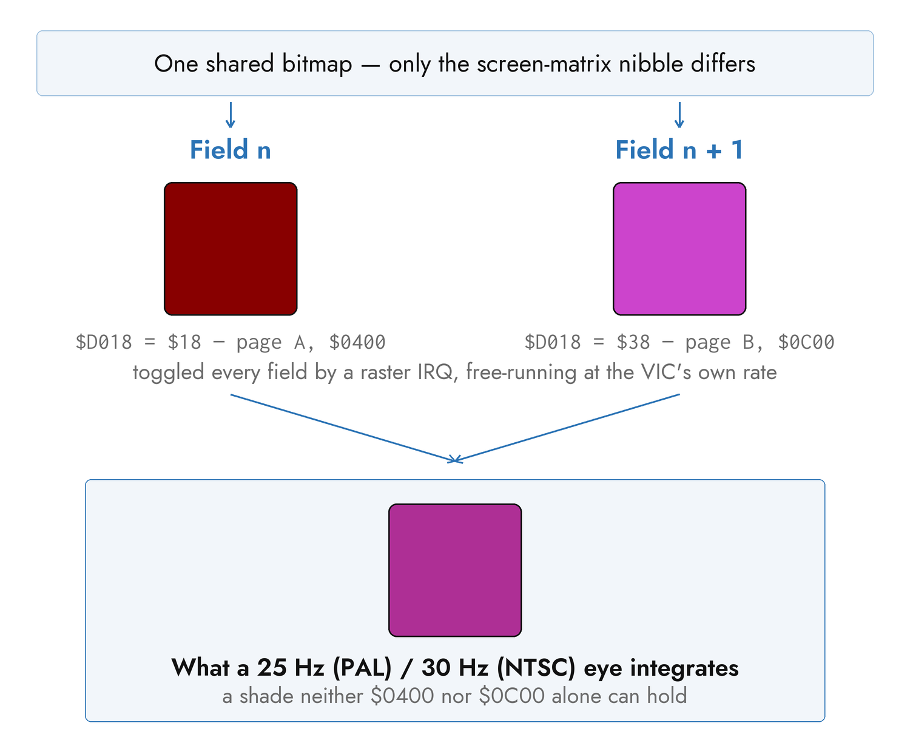

# The Display Pipeline

A frame arrives as ordinary color pixels and leaves as bytes the VIC-II can
render. Between those two states it is cropped, filtered, downscaled, shaped,
dithered, matched against sixteen colors, and packed into whatever memory
layout the display mode uses. This chapter is that path in order, and where
each setting that shapes it sits on it — nearly all of them `[color]`, plus
`[hardware].host_palette`, which says which sixteen colors the match is aiming
at in the first place.

The settings themselves are `[color]` and `[hardware]` in Appendix A,
`palette_mode` and `display` in Appendix B, and the generators and effects in
Appendix E.

## From Frame to Screen

Every frame-bearing scene follows the same sequence.

**1. The source produces a frame.** A camera hands over its newest frame with
no buffering; a video file hands over the frame nearest the audio clock; a
generator computes one at 320×200; a slideshow decodes an image; a WLED sink
assembles one from arriving packets.

**2. The frame is fitted to the Commodore's aspect.** The screen is 4:2.5 in
pixel terms, which no ordinary source is. `crop` center-crops to fill and
loses the margins; `fit` letterboxes onto black; `stretch` distorts. Camera
and video always crop. A slideshow chooses with `aspect_mode`.

**3. The effect chain runs.** Each layer transforms the frame in order, at
source resolution, before anything about the Commodore has been decided. This
is the last stage that sees full color and full resolution — see "The Effect
Chain" below.

**4. The frame is downscaled to the mode's grid.** Each display mode consumes
exactly one resolution: 40×25 for `petscii`, 80×50 for `mcm`, 320×200 for
`hires`, 160×200 for `mhires`. A video decoder is told that size up front and
downscales during color conversion rather than converting at full resolution
and throwing the pixels away.

**5. Colors are shaped.** Three stages, all before any quantization decision:
`channel_boost` applies a fixed per-channel gain, `hue_corrections` moves
chosen hue bands, and `auto_fit` stretches contrast and saturation to fill the
palette's gamut using statistics gathered from the source itself.

**6. A forced palette is applied, if one is in force.** This is a lookup
table, and it short-circuits the next stage: those pixels are already exact
palette colors, so dithering them would fight the assignment.

**7. Dithering.** The ordered family adds a position-dependent threshold
offset to every channel, nudging pixels across quantization boundaries. The
error-diffusion family instead replaces the final per-pixel decision, pushing
each pixel's error onto its neighbors.

**8. Every pixel is matched to the palette,** in weighted BGR or in CIE-Lab,
with the shaping biases folded into the distance. *Which* sixteen colors it is
matched against depends on the machine — see "Near To What" below.

**9. The mode allocates its color slots and packs its buffers** — which is
the part that differs per mode, and the subject of the next two sections.

**10. Overlays fold in.** A text overlay writes into those buffers rather than
poking memory itself, so its glyphs travel with the frame and land in the same
write.

**11. A fade or a brightness dim is applied** to a copy of the buffers, as a
palette remap.

**12. The buffers are pushed.** Only bytes that changed are sent; Chapter 5
covers the transport, the region cache, and the double-buffering that makes a
bitmap cut tear-free.

The on-screen display for live tuning and the `--frame-numbers` debug overlay
are drawn at step 3, before quantization, which is why they appear on every
display mode without either of them knowing what a display mode is.


## The Six Display Modes

A display mode is a *choice about the VIC-II*, and each one trades resolution
against color differently.

| Mode | Grid it consumes | Color it can show |
|---|---|---|
| `petscii` | 40×25 | one glyph and one of 16 colors per cell |
| `blank` | none | a solid canvas, for overlays |
| `mcm` | 80×50 | 3 shared backgrounds + one foreground per character cell |
| `hires` | 320×200 | 2 colors per 8×8 cell, one bit per pixel |
| `hires_edges` | 320×200 | as `hires`, over detected edges |
| `mhires` | 160×200 | a shared background + 3 colors per 4×8 cell |

**`petscii`** builds the picture out of the machine's own character set: each
cell takes a glyph chosen by brightness and a color chosen by hue. It is the
cheapest mode on the wire — 1000 bytes of screen and 1000 of color, against a
bitmap's 8000 — which is why character modes hold the full system frame rate
where bitmaps cannot. It is also, to most audiences, the most obviously a
Commodore.

The `style` key picks the glyph and color policy, and SHIFT cycles through
them live:

| Style | What it draws |
|---|---|
| `default` | Brightness onto an 11-character ramp, color per cell |
| `halftone` | A five-level block-coverage ramp: chunky and high contrast |
| `random_glyph` | A fixed random graphics glyph per cell, color still tracking |
| `letter_rain` | Brightness onto A–Z: a cascade of letters |
| `neon` | The default ramp with color clamped to the 10 chromatic entries |
| `inverse_pop` | Space or full block by threshold, in four pop-art colors |
| `hatch` | A five-level cross-hatch: sketched line art |
| `color_only` | Every cell a full block; the picture lives in color memory |
| `random` | One of the above, chosen once at setup |

Each style declares its own border and background, which the mode applies on
setup and on every cycle.

**`blank`** is the same character mode with no source at all — every cell a
space in the background color. It exists to be painted over.

**`mcm`** uploads a character set whose glyphs divide each hardware cell into
a 2×2 grid of blocks, giving an 80×50 grid of pixels where each block picks
one of four colors: three backgrounds shared by the whole screen, plus that
character cell's own foreground. The foreground is restricted to the first
eight palette entries, because the high bit of color memory is what marks the
cell as multicolor in the first place. Cheap on the wire like `petscii`,
with real color and no glyph character.

**`hires`** is a genuine 320×200 bitmap, one bit per pixel, where the bit
selects between two colors held in the nibbles of that 8×8 cell's screen
byte. One of the two is the global background, so the other one decides most of
the frame; `hires_cell_pick` below is how it is chosen. It is the sharpest mode
and the most expensive: 8000 bytes of bitmap for every frame that changes.

**`hires_edges`** runs Canny edge detection first and draws the edges. It is
the default for a live camera, and the reason is motion: an edge picture reads
as alive even when frames arrive slowly, where a stale half-tone bitmap reads
as broken.

**`mhires`** — multicolor bitmap — halves the horizontal resolution to 160 and
spends what it saves on color: each 4×8 cell gets a background shared with
the whole screen plus three colors of its own, two in the screen byte's
nibbles and one in color memory. A single frame can therefore carry up to
3001 distinct colors rather than four, which is why it is the default for
video and the right choice for photographs.

Two of these modes accept `palette_mode`, which decides how those per-cell
slots are filled:

| `palette_mode` | Effect |
|---|---|
| `percell` | The default. On `mhires`, a global background plus each cell's own three colors. On `mcm`, an accepted alias for `cheap` — that mode already picks a foreground per cell |
| `cheap` | One set of four colors for the whole screen, picked by pixel frequency |
| `vivid` | The same, but slots after the first prefer hues at least 45° from those already taken — for frames that keep collapsing to two near-shades |
| `grayscale` | Every decision restricted to the five gray entries, with the slots fixed in luminance order. An old-broadcast look, and stable enough to hold full frame rate |

`percell` is what makes `mhires` worth using: a cell that contains no
background color stops wasting a slot on it, and a corner of the frame stops
being forced into a palette chosen for the subject in the middle.


## Quantizing a Cell

Four settings decide what a cell ends up looking like, and they are orthogonal:
two pick *which* colors a cell may use — one for `mhires`, one for `hires` —
one picks *how near* is measured, and one decides which of the available colors
each pixel takes.

All four are read from `[color]`, but any scene can override its own copy of
any of them (and everything else in this section) in a `[scenes.color]`
sub-table — see ["Scenes and Playlists"](02-config-rules.md#scenes-and-playlists)
in the config rules chapter.

### Which Colors — `cell_strategy`

`mhires` with `palette_mode = "percell"` is the mode this question belongs to:
given every color present in a 4×8 cell, which three fill its slots?

| `cell_strategy` | Picks |
|---|---|
| `frequency` | The three most common. Temporally stable |
| `luminance` | Darkest, median and brightest, so a cell's full tonal span survives |
| `contrast` | The two luma extremes plus the color farthest from both |
| `error-min` | The trio that minimizes the cell's reconstruction error |

`"auto"` chooses `error-min` for a slideshow, where the image is composed once
and the search is paid for once, and `frequency` for anything in motion, where
stability matters more than optimality — the tonal strategies re-rank on noisy
content and churn the slots frame to frame.

On photographic material the strategies mostly agree; most cells hold three or
fewer colors after quantization, and every strategy then picks the same set.
They separate on busy, high-detail images. `luminance` and `contrast` can
speckle a near-flat region by forcing a tonal extreme onto a lone outlier
pixel, which is why `"auto"` never selects them.

### Which Color on a Hires Cell — `hires_cell_pick`

`hires` faces a narrower version of the same question. It gets two colors per
8×8 cell and one of them is the global background, so the only real choice is
the other one — which means this single decision sets most of the frame.

| `hires_cell_pick` | Picks |
|---|---|
| `error-min` | The default. The color that minimizes that cell's own reconstruction error, fitting all 64 pixels |
| `sample` | Reads one pixel per cell and takes its nearest color |

`error-min` reuses the distance matrix the quantizer has already built, so it
costs about 0.8 ms a frame. It buys roughly a quarter less reconstruction error
on photographic content — about −24 % mean Lab, holding across every `dither`
setting — and the gain tracks how much a cell's own pixels disagree: nothing on
a smooth gradient, around −32 % on high-frequency detail.

It is also the *stabler* of the two, which is the opposite of the trade
one-pixel sampling looks like it is making. A single read follows sensor noise
directly, so a static subject under a noisy camera rewrites cells that no human
would call changed; fitting the whole cell averages that noise out, and the same
subject stops writing to the screen at all. `sample` is therefore for a tight
CPU budget and nothing else. Neither applies to the `hires_edges` styles, which
are fixed at two colors by construction.

### How Near — `color_match`

The default distance is a brightness-weighted BGR metric: fast, but it
over-weights luminance, so a warm mid-gray — skin — can land nearer a gray
entry than orange or brown. `color_match = "perceptual"` measures in CIE-Lab
instead, which picks the color the eye calls closest.

`"auto"` chooses perceptual on every mode that picks colors at all, and the
weighted metric on the two that do not (`blank` and `hires_edges`). MCM gains
the most: smoother skin gradients and much less per-cell speckle.

Perceptual matching swaps the distance space and nothing else. The shaping —
`channel_boost` and the bias that keeps borderline pixels off the gray axis —
still applies, and that is deliberate: an accurate but unbiased match
fragments flat desaturated regions, a pale sky, into drab gray.

### Near To What — `[hardware].host_palette`

Both metrics measure distance to the sixteen C64 colors, which raises a question
neither of them answers: sixteen colors *as rendered by what?* The palette is
fixed as an idea and not as a set of RGB triples. An Ultimate 64's video output
and a real VIC-II's are about 25 counts per channel apart, and 60 apart on
orange.

That is not a tint the eye discounts and then forgives, because the quantizer
picks by distance: aim at the wrong table and pixels are sent to the wrong color
outright. Measured on an Ultimate 64 against the VIC-II rendering, that was
**18.8 % of pixels** and **+12.9 % mean perceptual error**, worst on the grays,
the browns and orange.

| `host_palette` | Means |
|---|---|
| `auto` | The default, and needs no configuration. Ask the machine: an Ultimate 64 reports its own palette, and anything else is driving a real C64, so assume a VIC-II |
| `u64` | The Ultimate 64's own table, stated outright |
| `pepto` | The classic VIC-II rendering — right for a real C64, so for an Ultimate II+ and for a TeensyROM+ in a breadbin |
| *a path* | A VICE `.vpl` file, which is how to describe a machine running a custom palette |

`auto` is right on every stock setup, and this is a setting most configurations
should never contain. Reach for it when the machine's palette is not the one its
backend implies: a `.vpl` loaded on the Ultimate, or a display whose own
processing you have already characterized. Point a path at a local copy of the
`.vpl` — an Ultimate will not serve its own over the network.

Note that this is a `[hardware]` setting rather than a `[color]` one, and
deliberately: it says what the *machine* emits, not what the show should look
like. It belongs with the other machine declarations, and a show file carried to
a second Commodore should not be the thing that describes the first one's video
output.

### Which Pixel Takes Which — `dither`

Dithering trades a little spatial noise for apparent colors the palette does
not have. Two families, and they are integrated differently:

**Ordered** — `ordered` and `blue_noise` — add a fixed, position-dependent
offset to every channel before the nearest-color search. They are one
vectorised operation over the frame, they hold real-time frame rates, and
because the pattern is constant at a given screen position a still source
dithers identically frame after frame and a moving one gains no shimmer.
`ordered` tiles the classic 8×8 Bayer matrix and shows its cross-hatch at C64
resolution; `blue_noise` tiles a mask with no low-frequency structure and does
not, at the same cost.

**Error diffusion** — `floyd-steinberg` and `atkinson` — instead replace the
final per-pixel decision, pushing each pixel's quantization error onto
neighbors not yet visited. Floyd-Steinberg spreads to four neighbors;
Atkinson spreads to six and deliberately discards a quarter of the error for
punchier contrast. Both are inherently sequential, and both re-diffuse
independently every frame with no memory, which is exactly why a sequence of
individually excellent frames reads as shimmer.

That is the whole argument behind `"auto"`: `floyd-steinberg` for a static
scene (a slideshow, composed once, where quality is free) and `blue_noise` for
anything in motion. An explicit value is honored for any scene type — you may
have Floyd-Steinberg on video, and the shimmer with it.

`dither_strength` means the same thing across both families, so switching
between them needs no retune. Dithering is skipped where a forced palette is
active, and `petscii` has no dither stage at all — its per-cell glyph and
color decision is not a pixel grid in the same sense.

## Forced and Rolling Palettes

Everything above tries to be *faithful*. `[color].force_palette` is the
setting that stops trying.

It clusters the source's colors into N groups and assigns each group a
**distinct** palette entry, so all N colors are used whether or not the
source has anything like them. A gamut-clustered source — a film that is
essentially black and one shade of blue — then renders in a full palette
instead of near-monochrome. It is false color on purpose, it is off by
default, and it applies on `mcm` and `mhires`.

```toml
[color]
force_palette = true
force_palette_colors = 8          # a count, 2..16
# force_palette_colors = ["black", "cyan", "white"]
```

A count spreads the source across that many distinct colors; an explicit list
whitelists exactly those, and its length becomes the count. Names are matched
loosely, as everywhere.

Like every other `[color]` field, `force_palette` and `force_palette_colors`
can be set per scene in a `[scenes.color]` sub-table — the way to put a
deliberately false-color scene next to a faithful one in the same show
without an in-between `[color]` change.

The map is derived one of two ways, by what the source is. A video or a
slideshow is **pre-scanned**: c64cast seeks to evenly spaced points through the
file, decodes one keyframe at each, and fixes the map before the first frame
appears. Sources with no future to scan — a camera, a generator, the WLED sink
— get a **rolling** map instead, re-derived about once a second from a sliding
window of recent frames.

Rolling has an obvious failure mode, which is popping, and three mechanisms
against it: each re-derivation starts from the previous one's clusters, the
cluster-to-color assignment is kept unless a new one is clearly better, and a
new map is installed only when the set of colors has actually changed — or
when a shot cut is detected, in which case the window is cleared deliberately
and the change hides behind the cut.

Choosing a good set by hand is guesswork, so there is a command for it:

```bash
c64cast --suggest-palette ~/Videos/clip.mkv
c64cast --suggest-palette ~/Pictures/skyline.jpg
```

It analyzes the source the same way the pre-scan does and prints the palette
entries that best represent it, ranked, ready to paste into
`force_palette_colors`. Note it optimizes for *faithfulness* — the colors
nearest what is there — where `force_palette` itself spreads to distinct
colors, so the two answer slightly different questions.

## Motion Smoothing and Fades

### `motion_smoothing`

The `mhires` per-cell path carries two pieces of temporal memory: a smoothed
history of which colors each cell has been offering, and a bias that keeps a
pixel on the palette entry it had last frame unless the new frame beats it
clearly. Both exist to stop per-frame color churn reading as shimmer on noisy
video, and both buy that stability by trading away motion tracking — on a hard
cut, structure from the previous shot lingers for a moment as an after-image.

`[color].motion_smoothing` is one dial over both, from 0 to 1:

| Value | Behavior |
|---|---|
| `1.0` | Full memory. The most stable, and the ghostiest |
| `0.25` | The default: chosen on hardware as the lowest value where flicker stays acceptable |
| `0.0` | No memory. Tracks the source exactly, and grainy content can flicker |

Lower it if after-images bother you; raise it if motion shimmers. It affects
nothing outside `mhires` with `palette_mode = "percell"`.

### Blending Colors the VIC Cannot Draw — `flicker_tolerance`

Off by default. `hires` (`"normal"` style) and `mhires` with
`palette_mode = "percell"` can hold **two** screen pages over one shared
bitmap and alternate `$D018` between them every video field, so the eye fuses
each cell's pair of hardware colors into a shade the sixteen-color palette
does not contain — the trick behind Dragon Breed's sky and Mayhem in
Monsterland's water. The alternation is owned by a C64-side raster IRQ that
free-runs at the VIC's field rate no matter how fast the host pushes frames,
so it costs nothing on the link beyond a second screen page.



Not every pair of colors is offered — each candidate was scored by eye,
blind, against how visibly it flickers — and `flicker_tolerance` is a cut
across that scale:

| `flicker_tolerance` | Admits | Colors reachable on an Ultimate 64 |
|---|---|---|
| `off` | Nothing. The default | 16 |
| `clean` | Pairs that fused cleanly | 24 |
| `subtle` | + pairs that flicker mildly | 30 |
| `visible` | + pairs that visibly flicker | 39 |

`visible` sits inside the frequency band recognized as a
photosensitive-seizure risk — treat it as an effect you have chosen to use,
not a free upgrade to the palette. `flicker_max_luma_delta` (default
`0.075`) is a separate, absolute cap on how far apart in brightness a pair
may be, checked for the same reason regardless of which tier admitted the
pair.

Which colors qualify depends on `[hardware].host_palette`: eligibility is a
statement about the light one machine emits, not about "the C64 palette" in
the abstract, so the table is rebuilt whenever the palette changes. Arming
also pins `color_match` to `perceptual` and `cell_strategy` to `error-min`,
because a blended color sits deliberately between two solids and only that
distance space and that search find the better fit for a cell. The border
cannot join in — `$D020` is a single register the field IRQ does not manage,
so it holds the field-A color throughout — and the effect does not survive a
30 fps capture: c64cast's own `[preview]` window and `[recording]` reconstruct
the fused color arithmetically, but a camera records the flicker.

### Fades

`[playlist].fade_duration_s` fades a scene up from black on entry and down to
black on a normal end, across every mode that composes buffers. Set it to 0
for hard cuts. A CTRL skip aborts a fade in progress, because a skip means
now.

The Commodore has no brightness register and its sixteen palette entries are
not ordered by luminance, so a fade cannot be an arithmetic dim. It is a
palette remap: for a given level, each color is replaced by the entry nearest
to that color scaled toward black, black always maps to black, and the table
is applied only to the color-bearing parts of the frame. The pixel selectors
are left alone, which is what keeps black pixels black while the picture
dims.

The same machinery serves the brightness slider on the WLED control surface,
as a persistent dim rather than a transient fade; the two multiply, so a
fade-out from a dimmed scene ramps down from the dimmed level. Scenes with no
composed buffers — the oscilloscopes, and a launched program — are untouched
by both.

## Generators

A `generative` scene draws its frames from one of twenty procedural sources.
Appendix E lists them all with their live parameters; this is how they behave.

Every generator renders at 320×200 and is downsampled by whichever display
mode is in force, so the same source is a different picture in `petscii` than
in `mhires` and both are worth trying. All of them are pure numpy, and all but
two are **deterministic in time**: the frame at a given moment is the same
frame forever, however you got there, which is what makes an offline render
reproducible. `soap` and `fireworks` carry real simulation state and are the
documented exceptions.

```toml
[[scenes]]
type = "generative"
display = "mhires"
source = "tunnel"
audio_source = "listen"
reactive = true
duration_s = 120.0
```

Each generator exposes one or two live parameters — usually a `speed` and a
`scale` — which a MIDI knob, the web console, or the WLED app's sliders can
sweep while the scene runs. Appendix F is the full list of live targets and
the names to address them by.

**Reacting to music.** With `reactive = true` and an audio source that
provides features, a generator reads a small snapshot every frame: the overall
level, whether a transient just fired, a beat phase, an estimated tempo, and
per-voice frequencies and gates. What each generator does with it is its own
business — plasma cycles hue with the tempo and flashes on a transient, halo
grows its circles with level, epicycle retunes its arms to the voices — but
the shape is always the same: at rest each falls back to its pure time-driven
behavior, so a silent scene is still the generator you asked for.

The features come from two producers behind one interface. A SID source runs
the tune a second time on a host-side emulator and reads envelopes and
oscillator frequencies from that, adding no traffic to the link. A microphone
or file source analyzes the audio directly and also fills in a real spectrum,
so bass and treble read differently. Which producer is running is invisible to
the generators.

## The Effect Chain

An effect transforms the whole frame after the source has drawn it and before
the display mode quantizes it, so effects work on *any* frame-bearing scene —
a video and a camera as readily as a generator.

A scene takes either one effect or an ordered chain, and the two spellings are
mutually exclusive:

```toml
effect = "trails"                             # one
effects = ["trails", "rgb_shift", "strobe"]   # a chain
```

Layers apply in order, and order matters: blurring a trail is not the same
picture as trailing a blur. Each layer is individually tunable while running —
`fx0.decay`, `fx1.intensity` — and individually bypassable, so a layer can be
dropped out and brought back live from a pad without rebuilding the scene. A
layer that fails is dropped from the chain rather than taking the scene with
it.

The eight effects and their parameters are Appendix E. Three of them —
`pulse`, `rgb_shift` and `strobe` — do nothing at all unless something is
driving them, which is what `mod_source` decides:

| `mod_source` | What drives the reactive layers |
|---|---|
| `audio` | The scene's own feature stream — a SID tune, a microphone, an audio file. The default |
| `clock` | The `[performance]` beat grid, so effects lock to MIDI or tapped tempo on *any* scene |
| `off` | Nothing; every layer holds its static baseline |

`clock` is the interesting one and the reason `strobe` exists: pointed at the
beat grid, a strobe flashes on the bar over a video that has no music of its
own to follow. Chapter 6 covers the grid, and where its tempo can come from.

Two effects are worth a note here because their behavior is not what the name
suggests. `blur` is not reactive at all — its identity comes from an intensity
of zero, so any non-zero value blurs every frame, with a transient adding a
kick on top. And `posterize` crushes each channel to a few levels, which
happens to be a good *preparation* for the palette reduction downstream as
well as a look in its own right.
