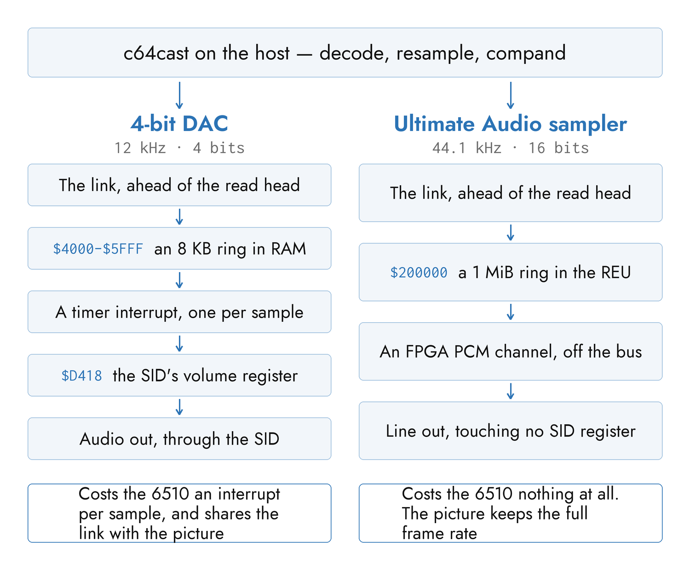

# Sound

The Commodore was never designed to play recorded audio. It has a
three-voice synthesiser and, on the Ultimate, a modern FPGA that can play PCM
from expansion memory; between those two facts sits everything c64cast does
with sound. This chapter is the sound path in both directions — a decoded
soundtrack going out, a SID tune playing on the real chip, and a microphone
coming back in to drive the picture.

The settings are `[audio]`, `[dsp]` and `[audio_features]` in Appendix A, and
the SID-related keys of `[ultimate64]` in the same place.

## Two Ways Out

There are two ways to get non-SID audio out of the machine, and which one you
get is the single most audible choice in the program.

| | 4-bit DAC | Ultimate Audio sampler |
|---|---|---|
| Where it plays | The SID's `$D418` volume register | An FPGA PCM channel, off the bus |
| Resolution | 4 bits, or ≈6–7 effective with a companding curve | 8 or 16 bits |
| Rate | 12 kHz by default | 44.1 kHz by default |
| Costs the 6510 | An interrupt per sample | Nothing at all |
| Available on | Everything | The Ultimate 64 / Ultimate II+ |

`[audio].backend` chooses: `"auto"` takes the sampler where the machine has
one and the DAC everywhere else, and `"dac"` forces the lo-fi path. Microphone
and webcam audio always take the DAC, on every machine.



### The 4-Bit DAC

The SID's master volume register is four bits wide. Write a sample value into
it fast enough and the chip's output level tracks the signal — this is the
digi trick C64 musicians have used since the 1980s, and it is the only method
that works on a real machine with the video still running.

An interrupt fires at the sample rate and writes one byte from a ring buffer
in the Commodore's memory; the host keeps that ring topped up over the link.
The interrupt is driven by a hardware timer that counts whole processor
cycles, so the achievable rates are a grid rather than a continuum:
`sample_rate` is a *request*, and what you get is the nearest point on that
grid. At the 12 kHz default on NTSC the real rate is 12032 Hz — a shift of
0.27 %, or 4.6 cents against a 50-cent quarter tone. It is the achieved rate,
not the requested one, that everything downstream uses as its timebase, so
nothing drifts against it and a decoded track plays at exactly real time.

12 kHz is the default because the interrupt handler cannot be serviced
indefinitely faster. The handler itself runs out of time near 13.5 kHz, and
the full streaming pipeline — where the host's own memory writes steal
processor cycles — starts overrunning near 12.5 kHz. Above that, handlers
queue behind each other and samples stretch: the tone goes flat. Rates that
overrun are rejected when the configuration loads, and `--doctor` reports
them.

> [!NOTE]
> The obvious alternative — pulse-width modulation on `$D402` — was
> measured and abandoned. At 8 kHz its carrier sits 9 dB *above* the audio
> signal, and at 16 kHz the VIC-II's badlines steal enough cycles that a
> 440 Hz test tone comes out at 421 Hz.

### The Ultimate Audio Sampler

The Ultimate's FPGA carries a PCM sampler that plays straight out of REU
memory. It touches no SID register, fires no interrupt, and costs the 6510
nothing, so it is immune to every problem in the section above and sounds
like the source rather than like 1987.

c64cast programs one channel as a loop over a 1 MiB ring in expansion memory
and writes decoded audio ahead of a read head it computes from the wall
clock. There is no feedback loop — the read position is never read back,
because it cannot be — so the whole path depends on knowing the FPGA's real
sample rate. That is what `[audio].sampler_clock_hz` is for; see "Keeping
Sound and Picture Together" below.

`sampler_sample_rate` and `sampler_bits` set the format, defaulting to
44100 and 16. An explicit `backend = "sampler"` on a machine that has none
warns and falls back to the DAC.

The sampler needs the REU enabled and the FPGA sampler mapped. c64cast turns
both on for the run and puts them back at teardown; the changes are live and
never written to the machine's flash, so a power cycle undoes them regardless.

### What Each Costs in Frame Rate

Audio on the DAC competes with the picture for the same link and the same
processor, so a scene streaming digitised audio caps its frame rate. Audio on
the sampler does not, and video keeps the full system rate. That table is in
Chapter 2 under "Frame Rate", and it is the main practical reason the sampler
is the default on the Ultimate.

The exception is a `generative` scene playing an audio file through the
sampler, which stays at half system rate: a generator draws a genuinely new
frame every tick where a video decoder repeats them, and 60 real bitmap frames
a second starves the sampler's own writes to expansion memory.

## Shaping the Signal

Four bits is about 24 dB of range. A signal that uses all of it sounds
present; one that does not collapses into a handful of levels and buzzes. So
everything on the DAC path runs through a host-side processing chain first,
in this order:

**Pre-emphasis** lifts the high frequencies, so consonants survive a 6 kHz
ceiling. **AGC** — microphone input only — corrects gross level. **The
expander** cleans the noise floor before anything raises it, with hysteresis
rather than a hard gate, so a signal hovering at the threshold does not
chatter. **The compressor** evens out what is left and applies makeup gain.
**The limiter** is the ceiling.

The order is load-bearing, and `[dsp].enabled = false` bypasses the whole
chain exactly. It applies to the `$D418` path only: the sampler is 16 bits
and needs none of it.

> [!NOTE]
> AGC is level-based, and cannot tell a quiet talker from a loud room. On a
> noisy microphone, prefer the expander and raise `agc_noise_floor_db` rather
> than chasing it with AGC.

### Companding — `dac_curve`

The classic path maps a sample to one of the sixteen volume levels and stops
there. `dac_curve` opens a better one.

In a particular SID setup — all three voices parked as steady DC sources, two
of them routed through the analog filter — the *whole* `$D418` byte becomes
audible, not just the volume nibble: the filter-mode bits and the voice-3-off
bit each shift the output level as well. The 256 values then select 256
distinct, strongly non-linear levels, worth about six to seven effective bits.
The cost is unchanged — still one write per sample — and only the values in
the ring differ.

| `dac_curve` | Meaning |
|---|---|
| `"auto"` | The default. A calibration measured from your own chip if one exists, else the built-in table on the Ultimate, else `"linear"` |
| `"linear"` | The plain 4-bit path |
| `"mahoney_ultisid"` | The built-in table, measured from the Ultimate's own emulated SID |
| `"calibrated"` | Force the measured table; an error if there is none |

The built-in table generalises across Ultimates because their SID is an FPGA
core and deterministic. Physical chips do not generalise at all — two 6581s
measured on the same rig correlated only 0.74, and swapping their tables cost
29 % in level error. So a socketed chip wants its own measurement:

```bash
c64cast -u u64://192.168.2.64 --calibrate-dac
```

That plays a ladder of levels through the chip, records the result through a
capture device, and writes a table. It takes about fifty seconds per SID
socket, and a machine with two socketed chips measures each one separately.
The file is keyed to the machine's own identity — the Ultimate's serial
number, a TeensyROM's USB serial — so a changed address does not orphan it.

> [!WARNING]
> A run replaces this machine's existing table outright. There is no prompt
> and no backup kept, so a re-measurement taken through a different capture
> device or at a different input level overwrites a good table with the new
> one. Copy the file out of the calibration directory first if the one you
> have is worth keeping.

The measurement is checked before it is kept. Sixteen of the 256 values set
the master volume to zero and *must* therefore be silent whatever else they
say; a table that fails that test is rejected rather than used, because a bad
calibration is worse than none. On the one chip where both were compared, the
measured table beat the plain 4-bit path by 2 dB while running 5.6 dB louder.

Two more knobs sit here. `[audio].dither` adds a little triangular noise
during encoding; it is off by default because at four bits the hiss it adds
costs more than the distortion it removes, and it is worth trying only on
already-noisy material. `[audio].digi_boost` parks the three voices to raise
the output level — mandatory on an 8580 by the classic literature, worth about
three times the level on a real 6581, and marked experimental because it has
not been tried on enough hardware.

## Keeping Sound and Picture Together

**Audio is the master clock.** A video scene chooses each frame against the
audio position rather than against a timer, so the two cannot drift apart over
a long clip however irregularly frames arrive. Everything in this section is
about making that audio position *true*.

### The Sampler's Clock

The sampler's design rate base is 6.25 MHz, and the U64's FPGA clocks it about
1.44 % slow. Since video is paced by the host's clock while audio clocks out of
the FPGA, that gap slides the sound behind the picture by seconds over a few
minutes — the beep drifting off the flash, worsening toward the end.

Nothing on the host can detect this: comparing the observed rate against the
assumed one agrees by construction, and there is no read-back to check against.
So the real figure is measured once and shipped as the default,
`[audio].sampler_clock_hz = 6160000`. It is a property of the firmware's clock
derivation rather than of an individual unit, so every U64 on the same firmware
wants the same value, and at that setting a five-second interval drifts by
1.3 ms. Hardware that clocks the sampler correctly can set 6250000.

### The Bitmap-and-DAC Time Stretch

Forcing the DAC path under a *bitmap* display mode makes everything play about
12 % slow, at correct pitch. The audio worker shares one link with heavy bitmap
writes; under that load it is throttled, the ring under-fills, and the
interrupt re-reads samples — which stretches time without changing pitch.
Video, slaved to the audio clock, follows it down.

The fix is to pre-compress the content by the inverse factor so the system's own
stretch nets back to real time. `[audio].dac_bitmap_tempo_mhires` and
`dac_bitmap_tempo_hires` hold the observed speed fractions, defaulting to the
values measured on an NTSC U64-II (0.88 and 0.89). They apply only to the DAC
backend under a bitmap mode; the sampler, the character modes and a muted scene
all pass through untouched. Other platforms differ — measure yours and set the
field.

### The Pitch Knobs That Default Off

Three settings correct the DAC path's pacing, and two of them are off.

`[audio].host_dma_servo` is on: it watches the gap between where the host is
writing and where the interrupt is reading, and stretches the worker's pace to
keep that gap near half a ring. It is orthogonal to pitch and should stay on.

`nmi_rate_adaptive` and the `pitch_mult_*` multipliers both push the interrupt
rate back up to compensate for stolen cycles, and there are no longer any
stolen cycles to compensate for: with the frame-rate caps and the staged
double-buffer in play, uncompensated mhires video on the DAC measures within
0.1 % of correct. Enabling either one only injects error — a static
multiplier of 1.015 overcorrects to +1.36 %, and the adaptive loop, whose
estimator reads about 12 % high, has driven a clip 8.5 % slow. They remain for
platforms that may still lose cycles, and they remain off.

## Playing SID Tunes

A `waveform` scene, and a `generative` scene with `audio_source = "sid"`, do
not stream audio at all. The tune is written into the Commodore's memory along
with a small player program, and the Commodore plays it on its own chip. That
is why a SID scene sounds exactly like the hardware: it *is* the hardware.

### The Player

The player is a hand-written 73-byte 6502 program, with a 35-byte re-INIT stub
beside it for subtune changes. By default they sit at `$C300` and `$C400`; a
tune whose payload would overlap moves them into the largest clear hole in
memory. Started, the player calls the tune's INIT once, installs its PLAY
routine on the interrupt vector, and then spins forever rather than returning
— INIT routinely destroys BASIC's zero-page state, so a return would print a
syntax error. The interrupt handler chains to the kernal's, which keeps the
keyboard scan alive and the cursor from blinking.

The player switches the memory banking around each call into the tune and puts
it back afterwards. That is not caution: tunes whose entry points sit under
BASIC ROM need it banked out to run at all, and tunes that read BASIC ROM
*as data* need it mapped back between calls, and tunes that assume the resting
configuration crash without the restore.

The firmware's own SID-player endpoint is deliberately not used. It draws its
own player interface on the HDMI output, over everything c64cast paints.

### What Is Refused

PSID files only, and four kinds of PSID are refused at setup with an
explanation:

| Refused | Because |
|---|---|
| RSID | It installs its own interrupt in INIT |
| `load_addr` below `$0820` | It would land on the BASIC stub that starts the player |
| A zero `play_addr` | INIT installs its own interrupt |
| Code under KERNAL ROM (`$E000-$FFFF`) | The player cannot bank the kernal out without losing the interrupt chain it needs |

A `waveform` scene additionally refuses a tune that would load low enough to
overwrite the oscilloscope's bitmap. When the scene's `file` is a directory or
a glob, a refused candidate is skipped and another drawn, so a folder of mixed
tunes still plays.

The PAL/NTSC speed flag in the header is ignored; the tune is played at the
kernal's default interrupt rate.

### How the Oscilloscope Knows

The SID is write-only. Reading `$D400-$D418` returns nothing useful, so
c64cast cannot ask the chip what it is doing. Instead it runs the same tune a
second time, on a host-side 6502 emulator, and watches the register writes
that emulator makes. The picture is drawn from those.

What that buys is a per-voice trace at the right frequency, waveform and
envelope, costing no traffic on the link at all. What it does not buy is phase
accuracy against the audio: the two are running the same code from the same
start, not sharing a clock. It is an oscilloscope of the music, not of the
output.

Multi-SID tunes are detected from the header (and from an HVSC-style filename
when the header understates the count), and each chip gets its own emulator
and its own column in each voice row.

### Duration and Subtunes

Playback gives no end-of-tune signal, so a scene ends when its timer does. Set
`[playlist].songlengths_file` to an HVSC song-length database and every tune
gets its real length automatically; without one, a tune with no explicit
`duration_s` runs for 30 seconds.

SHIFT advances to the next subtune, rebuilding the emulator and re-resolving
the duration. With a song-length database loaded, subtunes shorter than five
seconds are skipped while cycling — most of those are a game's sound effects,
and the scope of a sound effect is a flat line. A subtune you asked for
explicitly, or the file's own start song, always plays however short it is.

### Matching the Chip to the Tune

A PSID header says which SID model it was written for, and the two models
sound substantially different. `[ultimate64].sid_model` decides what to do
about that:

| Value | Behaviour |
|---|---|
| `"auto"` | The default. Read the header, per chip, and route each chip to hardware that matches |
| `"6581"` / `"8580"` | Force that model for every chip, ignoring the header |
| `"off"` | Do not inspect the header at all |

Matching is not transmutation. A socketed 6581 is a 6581; what autoconfig can
do is notice that the *other* socket holds the model the tune asked for and
remap the addresses, or fall back to one of the Ultimate's emulated SID cores
and set that core's filter curve to the requested model. If neither is
possible it warns and plays anyway.

For a multi-SID tune, routing and model matching happen in one pass, because
they cannot be separated: a router that places chips without regard to model,
followed by a corrector that moves them, will take away a core the router had
already given to another chip and leave it silent.

All of this is Ultimate-only, best-effort, and restored at teardown. On a
backend with no configuration interface the tune still plays; every chip past
the first is simply inaudible.

## Placing and Balancing Voices

The Ultimate mixes each audio *source* — physical socket 1, socket 2, and the
two emulated cores — at its own level and its own place in the stereo image.
Two settings drive that mixer, and both are indexed by source rather than by
chip: entry *k* addresses the *k*-th source the tune claims. Through four
chips the two coincide.

### `sid_panning`

`[ultimate64].sid_panning` spreads a tune's chips across the stereo field.
Each entry is an integer from −5 to 5, or the equivalent label. An empty list
takes the default spread:

| Chips | Spread |
|---|---|
| 1 | Centre |
| 2 | Left 3, Right 3 |
| 3 | Centre, Left 3, Right 3 |
| 4 | Left 2, Right 2, Left 5, Right 5 |

Those are ordered by musical importance rather than as a uniform fan: with an
odd count the primary chip sits dead centre and the others flank it. The
oscilloscope's columns follow the pans rather than the chip order, so a
three-chip tune reads left to right on screen exactly as it sounds.

There is one refusal. When chips outnumber the machine's available sources —
a three-chip tune with no usable socket, so all three land on two cores — the
spread would throw two chips hard left against one hard right, which
misrepresents the tune. The default collapses to centre instead. An explicit
`sid_panning` still does whatever you ask.

### `sid_volume`

This exists because of a specific silent failure. The Ultimate ships with the
two emulated cores' levels set to `OFF`, and routing a chip onto a core — which
multi-SID routing and model matching both do freely — then produces silence
with no error anywhere: the chip is mapped, the player writes to it, and
nothing comes out.

So the mixer is set deliberately, one source at a time:

| Source | Level |
|---|---|
| In use, with a `sid_volume` entry | That entry |
| In use, currently `OFF` | 0 dB |
| In use, at some other level | Left alone — a rig trimmed to −6 dB meant it |
| Not in use | `OFF` |

Muting the unused sources is the other half of the fix: a core still mapped at
an address the tune is using, with its level up, doubles the chip that is
really there.

Values are a dB integer, or a label. The hardware's ladder is not a uniform
fan — `OFF`, then −42, −36, −30, −27, −24, then every step from −18 to +6 — so
a level with no representation is rejected when the configuration loads rather
than snapped to a neighbour.

### Why a Spare Core Stays Mapped

The Ultimate's LED display is driven by emulated-core activity, so a tune
playing entirely on socketed chips lights nothing. Any core the plan does not
need is therefore pointed at the socket's address instead of being unmapped —
lit LEDs from the core, audio from the real chip — and muted, which is what
stops it from being heard as well as seen.

## ASID and MIDI

Two scenes drive the real SID from somewhere else entirely. Both need the
`midi` extra, and both draw the same oscilloscope as the waveform scene.

### ASID

ASID packs SID register writes into MIDI system-exclusive messages. An ASID
*host* sends the stream and the `asid` scene receives it and plays it on the
chip; Chapter 2's entry for that scene names the hosts and how to open a port
for them. It is a new input, not a fidelity change: the protocol carries only
what a SID can synthesise, never sampled audio.

There are two ways to play what arrives, chosen by `asid_buffered_player`.

The **coalesced** path keeps a shadow of each chip's registers and flushes a
block write sixty times a second. It works everywhere and it is bounded by the
link, which means a multispeed tune — one that plays several times per video
frame — loses the frames between flushes, mangling arpeggios and hard
restarts.

The **buffered ring player** moves frame consumption onto the Commodore. Each
frame's register writes are serialised into a slot, written into a ring in
expansion memory ahead of a computed read head, and popped one per tick by a
handler the machine's own timer fires — reproducing the stream's own
inter-write timing. Nothing is read back from the machine during playback. It
needs an REU, so it is Ultimate-only; `"auto"` selects it whenever there is
one. A two-times multispeed tune measured at exactly twice the coalesced
path's modulation rate, which is the whole point.

Multi-SID streams are honoured: extra chips are routed to their own addresses,
preferring physical sockets, and the scope subdivides each voice row into one
window per chip. `asid_multi_sid` and `asid_max_sids` gate and cap it. The
FM-synthesis command is recognised and dropped, there being no OPL chip
involved.

### MIDI

The `midi` scene turns the Commodore into a three-voice synthesiser. Notes set
each voice's frequency and gate; pitch-bend moves gated voices by up to two
semitones; velocity lands in the voice's sustain level.

Voice allocation layers a melody over a pad. Held notes keep their voice, and a
new note over capacity steals the most *recently* started one — so the older,
held notes form a stable pad while a line cycles on the top voice. Freeing a
voice brings back the most recent note still held. Re-using a voice that is
already sounding writes a gate-off before the new note, because the chip
re-attacks only on a gate edge; without it the pitch changes and nothing is
heard.

The controller map:

| CC | Target |
|---|---|
| 1 | Pulse width |
| 7 | Master volume |
| 71 | Resonance |
| 72 / 73 / 75 | Release / attack / decay |
| 74 | Filter cutoff |

The filter is audible because all three voices are routed through it; a cutoff
that starts open means a lowpass patch is neutral until you sweep it.

In the default `shared` voice mode one MIDI channel spreads across all three
voices. With `multitimbral`, `midi_voice_channels` routes channels to fixed
voices, each monophonic with last-note priority, and notes on unmapped channels
are ignored.

## Listening Back

Sound also comes *in*. With `reactive = true`, a generative scene reads a small
feature snapshot each frame and moves with the music. Two producers fill it,
and nothing downstream can tell which.

**From a SID tune**, the host-side emulator already knows each voice's
envelope and frequency, so the features come free — no extra traffic, no
analysis.

**From audio**, an analyser runs over the incoming samples. It reports:

| Feature | What it is |
|---|---|
| `level` | Loudness *relative* to a rolling peak, so a quiet feed still reaches full scale and true silence reads zero |
| `onset` | A transient: a spectral-flux crossing against an adaptive threshold, latching to 1 and decaying |
| `bands` | Eight log-spaced bands, the same ranges the spectrum overlay draws |
| `bpm`, `beat_phase` | An estimated tempo and a continuously integrated phase |

`[audio_features].onset_sensitivity` is the one knob worth turning: dense,
heavily compressed material reads as continuous transients at high values, and
sparse material needs a push.

### `mic` and `listen`

The two differ in more than whether the Commodore makes a sound.

`audio_source = "mic"` streams the input to the DAC *and* analyses it, so the
analyser opens at the DAC's rate — it should see what the machine actually
plays. `audio_source = "listen"` sends nothing to the Commodore, which frees it
from that rate: it captures at `[audio_features].listen_sample_rate`, 44.1 kHz
by default, so hi-hats and cymbals above the DAC's 6 kHz ceiling exist at all
and transients land more precisely. That is the VJ arrangement — the real music
is on a PA, and only the picture tracks it.

In both cases the analyser taps the signal *before* the processing chain.
Compression exists to flatten dynamics into four bits, and dynamics are exactly
what an onset detector reads; a compressed kick barely moves the spectral flux.

### What Reads the Features

Generators react through `level`, `onset`, `beat_phase` and the bands — bass
drives brightness and treble drives hue, because a desaturated hue quantises
into the greys and would read as nothing. The reactive effects (`pulse`,
`rgb_shift`, `strobe`) take the same stream, or the beat grid instead, by
`mod_source`. Both spectrum overlays read the scene's features first and fall
back to analysing the audio stream, which is how they work on a SID scene where
there is no audio stream at all. And with `[performance].tempo_source =
"audio"`, the detected tempo drives the process-wide beat grid — see Chapter 6.

Neither producer fills the whole snapshot. A SID source reads envelopes rather
than a spectrum, so it reports no bands, and its onsets come from note gates
and hard restarts rather than from spectral flux. An audio source has no
per-voice frequencies or gates to report. Each side leaves what it lacks empty,
and the generators that read those fall back to their base behaviour rather
than freezing — which is also why the same generator looks a little different
driven by a tune than driven by a microphone.
