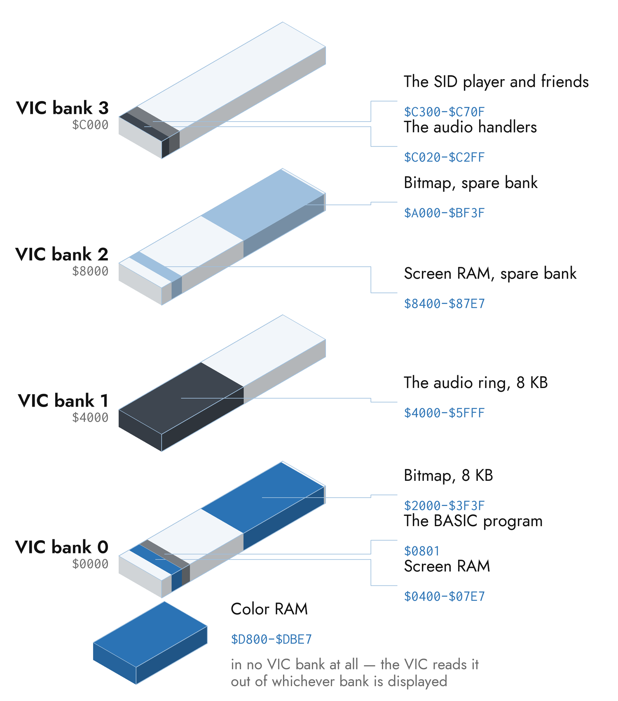

# The Link and the Memory Map

Everything in the previous two chapters ends with bytes arriving in a
Commodore's memory. This chapter is about that arrival: how the bytes get
there, where they land, how c64cast avoids sending the ones that have not
changed, and what a frame can afford.

None of it is required to use c64cast. It is required to reason about why a
scene is slow, why two features refuse to run together, and what a picture
costs before you ask for it.

## Getting Bytes In

The link is split by what each operation costs.

**Writes go over the Ultimate DMA Service** — a persistent TCP connection on
port 64, one command per write, about 5 ms each and roughly 200 a second
sustained. The connection opens when the run starts, so a machine with the
service switched off fails immediately with an actionable message rather than
halfway through the first scene.

**Reads, resets, program launches and the startup probe go over REST.** They
are low-rate and one-shot, so the HTTP path's throughput does not matter — and
they have no DMA equivalent.

That split is not a preference. The Ultimate's HTTP server closes the
connection on every response and refuses keep-alive, so each request pays a
fresh TCP handshake, and it serializes concurrent requests internally. Measured
on a wired LAN:

| Transport | Per-write latency (avg / p50 / p95) | Sustained |
|---|---|---|
| REST | 14.0 / 14.8 / 19.9 ms | ≈71 writes/s |
| Socket DMA | 5.3 / 5.0 / 6.8 ms | ≈200 writes/s |

Throwing threads at REST makes it *worse* — eight parallel writers measured
65 writes a second, because they queue at a single-threaded server and pay
eight TCP setups to do it. The persistent socket is the whole difference.

The DMA service accepts **one connection at a time**. That is why the audio
path and the render path share a single client rather than opening a socket
each: a second connection is accepted but never answered, and it blocks the
first for several seconds after it closes. The shared client serializes commands
with a mutex, and the combined rate — audio about eight writes a second, render
thirty to sixty — sits well under the ceiling.

### The TeensyROM Link

The other backend speaks its own protocol over USB serial or TCP, both at about
106 KiB/s. There is no REST surface, so the operations the Ultimate does over
HTTP happen differently: a program is uploaded and launched over the same link,
and the SID player is started by swapping the interrupt vector so the next
kernal interrupt runs it — no reset, no boot, and therefore none of the races
that come with one.

Reading memory needs cycle-clean firmware (v0.7.2.5 or later). Without it the
keyboard poller, the on-C64 menu and the character-ROM dump are unavailable,
and c64cast says so rather than failing later.

### What Each Backend Can Do

Several features are gated on a capability rather than on a backend name, and a
configuration that asks for one the machine lacks is degraded with a warning
rather than refused:

| Capability | Ultimate | TeensyROM+ |
|---|---|---|
| Memory writes | ✓ | ✓ |
| Memory reads | ✓ | firmware v0.7.2.5+ |
| Reset, program launch | ✓ | ✓ |
| Expansion memory (REU) | ✓ | — |
| Device configuration API | ✓ | — |
| Ultimate Audio sampler | ✓ | — |

No REU means no staged video, no expansion-memory audio pump, and no buffered
ASID ring player; those settings are forced off on such a backend, and
`--doctor` reports it. No configuration API means SID address routing, model
matching, panning and mixer levels are all no-ops — a multi-SID tune still draws
every chip's scope, but only the first is audible.

## What Lands in Memory

c64cast writes into a real Commodore's 64 KB, alongside a running BASIC program
and the kernal. What follows is what it claims, and why.



### The Picture

| Address | Contents |
|---|---|
| `$0400-$07E7` | Screen RAM, VIC bank 0 |
| `$2000-$3F3F` | Bitmap, VIC bank 0 |
| `$8400-$87E7` | Screen RAM, VIC bank 2 — double-buffered paths only |
| `$A000-$BF3F` | Bitmap, VIC bank 2 — double-buffered paths only |
| `$D800-$DBE7` | Color RAM |

Character modes use screen and color RAM. Bitmap modes use the bitmap plus
screen RAM, where hires packs its two per-cell colors into that byte's two
nibbles; multicolor bitmap adds color RAM for its third.

Color RAM is **not** part of a VIC bank. There is one of it, and the VIC reads
it whichever bank is displayed — which is the one asymmetry in the
double-buffered paths, and the reason a multicolor bitmap's third per-cell
color can still tear across a bank swap while the picture itself does not.

### Sound

| Address | Contents |
|---|---|
| `$4000-$5FFF` | The 8 KB audio ring the interrupt reads from |
| `$C020` | The interrupt handler that writes `$D418` |
| `$C100` | The expansion-memory pump handler |
| `$C200` | Its three-byte source tracker |

The ring lives at `$4000` — VIC bank 1 — deliberately. Banks 0 and 2 are the
ones the display paths use, and are also the two banks where the character ROM
is shadowed; the 6510 sees `$4000` as ordinary RAM whatever the VIC is doing.
A bitmap mode wanting bank 1 for itself would have to move the ring. Nothing
does today.

### The SID Player and Friends

| Address | Contents |
|---|---|
| `$0801` | The one-line BASIC program that starts the player |
| `$C300` | The SID player, by default |
| `$C400` | Its re-INIT stub, by default |
| `$C500` | The bank-swap interrupt handler |
| `$C700-$C70F` | The frame tracker that handler reads |

`$C000-$C2FF` belongs to audio, which is why the player starts at `$C300` and
why the relocator refuses any layout that would overlap it. A tune whose payload
covers `$C300` moves the player into the largest clear hole instead.

The frame tracker is sixteen bytes packed contiguously so the host can stage a
whole frame's parameters in one write. The wire's ordering then guarantees the
interrupt sees either all of the new values or all of the old ones, never a
fresh ready flag paired with half-written registers.

### Expansion Memory

The REU is used as staging: the host writes into it without touching the
Commodore's bus at all, and one transfer moves the bytes into main memory.

| Offset | Contents |
|---|---|
| `$000000` | A video scene's pre-encoded soundtrack |
| `$100000` | The 64 KB microphone ring |
| `$200000` | The 1 MiB sampler ring |
| `$300000` | The ASID ring player's frame slots |
| `$E00000` | Character-mode screen staging |
| `$E10000` | Bitmap, screen and color staging |

c64cast provisions the REU at 16 MB for a run that needs one and puts the
original settings back at teardown. Those changes are live and never written to
flash, so a power cycle reverts them even if teardown is missed.

### The BASIC Program Underneath

After the reset that starts a session, c64cast runs a 25-byte BASIC program:
clear the screen, then loop forever. It is doing two jobs. Clearing removes the
`READY.` banner. Looping keeps BASIC busy, and so out of the editor's
direct-input mode — the only thing that re-arms the cursor blink — which is why
no cursor ever appears over the picture.

It also keeps running underneath every scene. The display writes overwrite
screen and VIC memory, never the BASIC program, so the kernal's interrupt keeps
scanning the keyboard the whole time. That is what makes the C= / CTRL / SHIFT
keys work *during* a scene at all — and it is why the TeensyROM's paused state
clears the screen rather than resetting. A reset there lands at the cartridge's
own menu, whose input handling does not run the kernal scan, and the resume key
would never be seen.

### The Character ROM

Every C64-native glyph c64cast draws — the text overlays folded into a bitmap,
the scroller, the oscilloscope's labels, the on-C64 menu, and the preview and
recording renderers — comes from the character ROM.

The ROM cannot be fetched from the host. Reading `$D000` returns the I/O page,
because what is mapped there is decided on the Commodore, at read time. So
c64cast runs a stub on the machine that unmaps I/O, copies the 4 KB down into
plain RAM, and puts the banking back; the host then reads the copy. That happens
once, on the first run against a given machine, and the result is cached under
the data directory.

The copy is verified structurally rather than against a known image — a Swedish
machine's charset, or a JiffyDOS font, is exactly the charset that user wants.
What is checked is that it *is* a charset: two full sets, the upper half
complementing the lower, screen code `$20` blank and `$01` not. A file that
fails is not written, because an unverified one is worse than none and would
suppress the automatic dump forever.

With no ROM resolved, glyphs fall back to a rendered ASCII font. It is legible,
it is not the C64 font, and PETSCII graphics characters come out blank — which
is the whole explanation for a scroller that "looks wrong". `--doctor` reports
which ROM is in use.

No ROM bytes enter the repository, the wheel, or a release. They move from your
hardware to your disk and stop there.

## Regions and the Dirty Model

Sending 8000 bytes of bitmap sixty times a second is 480 KB/s of writes over a
link that carries about 200 commands a second. Two mechanisms make that
arithmetic work.

**Coalescing.** Contiguous register writes go out as one command: the border and
three background registers are four addresses and one write.

**The dirty cache.** Every buffer upload goes through a call that remembers what
it last sent for that region and transmits only the sub-range that changed. A
static character-mode scene therefore writes almost nothing after its first
frame, which is why those modes hold the full system rate where a bitmap cannot.
Past a threshold — more than 60 % of the region differing — it abandons the diff
and sends the whole buffer, since one large write beats several scattered ones.

**The cache is keyed by region, not by address.** A region is a small integer
naming a logical buffer: the screen, color RAM, the bitmap, one voice's strip
of the oscilloscope, one row of the on-C64 menu, and — importantly — bank 2's
bitmap and screen separately from bank 0's. Keying by address would be wrong in
two ways at once. A mode switch from PETSCII to multicolor text writes different
meanings to the same `$0400`, and a double-buffered path writes two alternating
banks that must each diff against their own previous content rather than against
each other's.

A display mode invalidates the cache when it sets up, so a mode switch starts
from a clean baseline instead of diffing new bytes against the previous mode's
reading of the same addresses.

### Why Cuts Do Not Tear

Writing 8000 bytes takes long enough that the VIC will draw part of the old
frame and part of the new one. Both fixes give the machine two banks and flip
between them.

**REU staging** writes the frame into expansion memory — which touches no bus —
and a raster interrupt at the start of vblank then triggers the transfers into
the off-screen bank and flips `$DD00`. The flip is a single store and lands
inside vblank, so the swap is invisible.

**Host-DMA double-buffering** does the same page flip without needing an REU:
the host writes the off-screen bank directly, then arms a three-byte tracker,
and the interrupt does nothing but change two registers.

They are mutually exclusive — both flip the same register — and `"auto"`
chooses between them. REU staging wins on a machine that has one, except for a
bitmap scene carrying a text overlay: the transfers inside that interrupt run
long enough to push the flip past vblank into the visible rows, and fine glyphs
in the bottom rows shimmer. Those scenes take the host-DMA page flip instead,
whose interrupt does no transfers at all and therefore always lands in time.
Character modes stay on plain writes under `"auto"`, because their dirty cache
makes a full per-frame transfer a regression.

Any uncertainty — no REU, a failed query, `--skip-probe`, a backend without one
— degrades to plain writes, so video never silently freezes.

## The Write Budget

A frame's cost is the number of write commands it takes, not the number of
bytes, and the ceiling is roughly 200 commands a second.

| Scene | What a frame costs |
|---|---|
| Character mode, static content | Almost nothing; the cache absorbs it |
| Character mode, live video | Two regions, mostly partial |
| Hires bitmap | 8000 bytes of bitmap plus 1000 of screen |
| Multicolor bitmap | The same, plus 1000 of color RAM |
| Oscilloscope, scrolling | The strips rewritten every frame, ≈700 KB/s |

That arithmetic is where the default frame-rate caps in Chapter 2 come from. A
bitmap scene streaming digitized audio is the heaviest case in the program, and
20 fps is where it fits.

`--profile` prints what is actually happening, per scene, every ten seconds.
It comes out as one long line per scene; it is broken at its separators here,
and indented, so that it fits the page:

```text
profile[webcam:mcm] n=58 |
    frame avg=33.4 p50=33.3 p95=34.1 max=41.2 ms |
    cpu_render avg=12.8 ... |
    compose avg=5.4 ... |
    push avg=7.0 ... |
    wait avg=20.5 ... |
    writes/frame avg=24 p95=27 |
    bytes/frame avg=8192 p95=8192
u64 dma latency: n=256 avg=5.1 p50=4.9 p95=7.8 max=18.4 ms
```

`frame` is wall-clock per frame and should sit near `1 / target_fps` at steady
state. `wait` is time asleep waiting for the next deadline — a healthy scene has
plenty of it. `compose` is host-side quantization and `push` is the link. When
`wait` approaches zero and `push` dominates, you are out of budget on the wire;
when `compose` dominates, you are out of it on the CPU, and the two have
different answers.

When a frame runs late the playlist advances its deadline and **drops** the
missed frames rather than bursting to catch up. Animation reads wall-clock time,
so a dropped frame costs smoothness and never position.

### What to Give Up First

In order of what they buy against what they cost:

1. **The display mode.** A character mode is an eighth of a bitmap's traffic.
   This is by far the largest lever, and it is not a downgrade — for many
   audiences PETSCII is the point.
2. **`target_fps`.** Halving it halves everything.
3. **The dither method.** The error-diffusion methods are per-pixel loops; the
   ordered family is one vectorised operation. That is a `compose` cost, not a
   `push` cost.
4. **`cell_strategy`.** `error-min` scores twenty color trios per cell —
   excellent for a slideshow, unnecessary for motion.
5. **Overlays.** Each composes into the frame, and a marquee changes cells every
   frame, which keeps its region permanently dirty.

What not to give up: coalescing and the dirty cache are automatic, and any new
code path that issues many small writes per frame is the first thing to look at.
